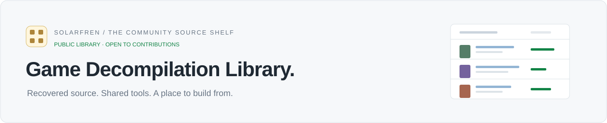

<p align="center"></p>

# Game Decompilation Library — final accuracy report

**Audit date: 2026-10-04 (UTC).** This README contains the final report, corrections, limits and an entry-by-entry audit of the complete 303-project snapshot.

[Interactive library](https://solarfren69420.github.io/GameDecompLibrary/) · [Full catalog](CATALOG.md) · [Submit your GitHub](https://github.com/solarfren69420/GameDecompLibrary/issues/new?template=add-project.yml) · [Suggest a correction](https://github.com/solarfren69420/GameDecompLibrary/issues/new?template=update-project.yml)

<!-- catalog-stats:start -->
**303 projects** · 220 game projects · 71 tools · 11 related projects · 1 unconfirmed link
<!-- catalog-stats:end -->

## Result

| Check | Result |
| --- | --- |
| Original catalog preservation | All 303 original project URLs retained; no repository silently removed |
| Repository reachability | 302 reachable; 1 original URL still returns 404 and remains explicitly unconfirmed |
| Listed evidence | All 713 recorded source checks succeeded, covering 712 distinct evidence URLs in this audited snapshot |
| Tracker percentages | All 202 tracker records checked against HTML and structured JSON, including repository, platform, target, commit and report timestamp |
| Other numerical metrics | 7 published badge/README metrics checked; Zelda code figures additionally checked against matching-code CSVs |
| Completion wording | 4 full/complete maintainer claims preserved as qualitative claims with null numeric values |
| Function counts | Star Fox 64’s 2951/2951 matching-function badge kept separate from matching-byte metrics |
| Tools and related projects | All 71 tools and 11 related projects retain null game-decompilation percentages; basic purposes reviewed |
| Refreshed reports | 12 newer tracker reports incorporated; 7 changed numerical percentages and 5 changed commit metadata only |
| Library verification | 19 automated tests passed; browser checks passed for search, numeric precision, filters, pagination, source/edit links, shared links, empty state and mobile overflow |

**The checked figures are published source claims and metrics, not measurements made by this library.** The audit supports the catalog’s links, attribution, basic categories and specifically scoped percentages. It does not certify that every upstream project builds, plays correctly, supports every version, or is complete.

## What “triple checked” means

1. **Import and structure:** compared the project URL set with the original archived list, checked duplicates and required fields, retained unknown values as `null`, and separated games, tools, related projects and the known missing link.
2. **Primary sources:** retrieved upstream READMEs or repository pages and every cited evidence URL. Reviewed basic purpose and important source qualifications for tools, related projects and non-tracker entries. A successful HTTP response alone was never treated as proof of completion.
3. **Published metrics:** compared all 202 tracker HTML headlines and linked percentages with their higher-precision JSON measures, repository identity, platform, version, commit and timestamp. Pinned the source URLs to those exact reports. Checked the seven supplemental numerical claims against their badges or READMEs, and checked Zelda’s target, code totals and stored report commits against dashboard metadata and CSVs.

HTML and JSON are two representations of the same published report. They provide a consistency check, not an independent reconstruction of the original game binary. Live sources changed during the audit; commit-pinned evidence prevents those changes from silently invalidating the catalog’s snapshot.

Where the tracker headline omits a fully-linked percentage, the table keeps `—`. A zero/default `complete_code_percent` in the JSON is not promoted into an independently established link-completion claim. This differs from a percentage explicitly published in the headline.

## Refreshed tracker records

These changes reflect newer upstream reports. Earlier imported values remain in the archived source list as historical snapshots; the existence of a newer report does not establish that the old snapshot was fabricated.

| Project | Earlier decompiled / linked | Audited decompiled / linked | Target | Underlying report date (UTC) |
| --- | --- | --- | --- | --- |
| [Super Mario Sunshine](https://decomp.dev/doldecomp/sms/GMSJ01/b10839666abeeaad1d371032c8824ed9688adc06) | 47.12% / 18.26% | 47.12% / 18.26% | GMSJ01 | 2026-10-04 10:43:53 +00:00 |
| [Digimon World 3](https://decomp.dev/juandav/dw3_decomp/SLES_039.36/ab41a5c2b02155e0ed1d29f9cbccbf846dba3c6e) | 99.13% / not shown in headline | 99.13% / not shown in headline | SLES_039.36 | 2026-10-04 12:09:05 +00:00 |
| [Parasite Eve](https://decomp.dev/khasinski/parasite-eve-decomp/SLUS_006.62/add85754bab8a60518acc3cee5695d81669b2250) | 95.5% / 95.5% | 96.8% / 96.8% | SLUS_006.62 | 2026-10-04 12:06:52 +00:00 |
| [Ratchet &amp; Clank (PAL)](https://decomp.dev/Lynder063/rac1-decomp/SCES_509.16/9ca0f7f71f8881c8bbc5b388f48327af9dd43be2) | 20.24% / 2.43% | 20.24% / 2.43% | SCES_509.16 | 2026-10-04 11:49:50 +00:00 |
| [Shin Megami Tensei: Digital Devil Saga](https://decomp.dev/Megami-Decomps/dds-decomp/dds1/810b4769868d9d02e59f96ec51d4e784970fdcfc) | 44.95% / not shown in headline | 45.36% / not shown in headline | dds1 | 2026-10-04 12:15:27 +00:00 |
| [Kirby: Nightmare in Dream Land](https://decomp.dev/overjt/knidl/A7KE/48239761d38a706896626a4dab0484b6115a95e5) | 99.51% / 99.51% | 100% / 100% | A7KE | 2026-10-04 12:11:35 +00:00 |
| [Kingdom Hearts: Chain of Memories](https://decomp.dev/Pheenoh/khcom/us/d7b19676c61634630a559ba5db66fe60b91eaefe) | 100% / 100% | 100% / 100% | us | 2026-10-04 11:34:54 +00:00 |
| [Metroid Prime 2: Echoes](https://decomp.dev/PrimeDecomp/echoes/G2ME01/e5eddac466d3e36de231ad91e59d0e4d4b3a6232) | 25.85% / 10.53% | 25.86% / 10.54% | G2ME01 | 2026-10-04 11:39:42 +00:00 |
| [Super Mario 3D World + Bowser&#x27;s Fury](https://decomp.dev/shibbo/3DWDecomp/1.0.0/0e10244e1bc398d4d66e53f517af805ddb3f5d98) | 29.18% / 10.49% | 29.29% / 10.49% | 1.0.0 | 2026-10-04 12:20:30 +00:00 |
| [Ratchet &amp; Clank: Up Your Arsenal](https://decomp.dev/vetusmagnus/ratchet-uya-decomp/SCUS_973.53/b15cbb603d2ef399240f0a27af0f1d40ca0b0458) | 1.64% / not shown in headline | 1.64% / not shown in headline | SCUS_973.53 | 2026-10-04 12:07:02 +00:00 |
| [Digimon World 2](https://decomp.dev/Wyrelade/Digimon-World-2-Decomp/SLUS-01193/2eda38446be372ebf6b7a976e66f6cef077f5f3e) | 99.56% / not shown in headline | 99.61% / not shown in headline | SLUS-01193 | 2026-10-04 11:36:00 +00:00 |
| [Mario Strikers Charged](https://decomp.dev/yannicksuter/mscharged-decomp/R4QE01/f84e4666a76d2b6b7abf41b2c6874583484392fa) | 94.22% / 86.67% | 94.28% / 87.04% | R4QE01 | 2026-10-04 11:34:20 +00:00 |

## Corrections and source qualifications

| Project or issue | Correction / qualification | Primary evidence |
| --- | --- | --- |
| Generic project type | Removed the blanket “Matching decompilation” type. A game decompilation is not automatically a byte-matching reconstruction. OpenGOAL and Sonic Mania have more specific project types. | Upstream READMEs in the per-entry checks below |
| Ocarina of Time | The dashboard’s 100% code metric covers the **Master Quest debug ROM**. The stored report is from **2024-08-15**. The broader upstream README still calls the project WIP and says it does not produce a PC port. | [Dashboard metadata](https://zelda.deco.mp/assets/json/games.json), [matching-code CSV](https://zelda.deco.mp/assets/csv/progress-oot-matching.csv), [README](https://github.com/zeldaret/oot) |
| Majora’s Mask | 100% is **code progress for the tracked US target**. The **2026-07-19** dashboard report contains incomplete byte matching in several asset categories. No overall game/asset completion is asserted. | [Matching CSV](https://zelda.deco.mp/assets/csv/progress-mm-matching.csv), [README](https://github.com/zeldaret/mm) |
| Mario Kart 64 | Confirmed its 100.0% **total-progress badge**. The badge denominator was not independently established, so it is not presented as independently measured matching-byte telemetry. The README notes missing byte-matching tkmk00 compression tooling. | [Badge](https://n64decomp.github.io/mk64/total_progress.svg), [README](https://github.com/n64decomp/mk64) |
| Diddy Kong Racing | The README publishes 100.00% decompilation for **us.v77**, while documentation is separately reported at 69.02%. | [README](https://github.com/davidsm64/diddy-kong-racing) |
| Breath of the Wild | Confirmed the 17.489% badge and the **Switch 1.5.0** README target; the repository describes itself as experimental and WIP. | [Badge](https://botw.link/badges/progress.json), [README](https://github.com/zeldaret/botw) |
| OpenGOAL | Jak 1 is described as polished/complete, Jak II as essentially complete but in beta, and Jak 3 as having substantial work left. No blanket trilogy percentage or matching-byte completion inferred. | [README](https://github.com/open-goal/jak-project) |
| Super Mario 64, Perfect Dark, LEGO Island and Sonic Mania | Full/complete wording is a maintainer/project statement. Removed percentage-like wording from qualitative labels; numeric fields stay null. | Upstream READMEs / repository descriptions linked in the complete results below |
| Mod Engine 2 | Added the upstream notice that development is discontinued and future work is in me3. | [README](https://github.com/soulsmods/ModEngine2) |
| google/autocxx | Added Google’s notice that it no longer maintains the project; the upstream README points to alternatives and a fork. | [README](https://github.com/google/autocxx) |
| icewind1991/vbsp | Preserved the GitHub URL and added its announced move to Codeberg. | [README](https://github.com/icewind1991/vbsp) |
| unreal-rust | Added the README’s explicit proof-of-concept / not-ready-for-a-real-project qualification. | [README](https://github.com/MaikKlein/unreal-rust) |
| Marathon Recompiled | Added the upstream pre-release notice that it is under active development and is not intended for public use before an official release. | [README](https://github.com/sonicnext-dev/MarathonRecomp) |
| Proptest and Doom 3 BFG | Corrected the evidence paths to Proptest’s nested README and Doom 3 BFG’s README.txt. Added direct source evidence for related-project entries. | [Proptest README](https://github.com/proptest-rs/proptest/blob/main/proptest/README.md), [Doom README](https://github.com/id-Software/DOOM-3-BFG/blob/master/README.txt) |
| Report URL with spaces/emoji | Properly encoded the Alchemy target name so its commit-pinned evidence URL can be retrieved. | Per-entry report below |
| Library maintenance checks | Fixed the original preservation test to permit new submissions while still requiring every original URL to remain. Invalid calendar dates are now rejected. | [Catalog checks](tests/test_catalog.py) |

## Known unresolved link

[Mortal Kombat: Deception — skylaralbers/mkd-decomp-local-](https://github.com/skylaralbers/mkd-decomp-local-) still returns **HTTP 404**. The audit cannot distinguish a deleted, private, renamed or mistyped repository from that response. Its original link is preserved in the unconfirmed section, with no verified percentage.

## Limits of this report

- Reachability and source consistency were checked at the stated audit date. Future repository moves or reports can change the current state.
- A decompiled percentage describes its published target and denominator. It is not overall asset, documentation, port or gameplay completion. “Fully linked” is a separate measure.
- A badge value, a maintainer’s full/complete statement, a function count and a byte-based tracker measure are distinct kinds of evidence. Their values are not interchangeable.
- Upstream projects were not built or gameplay-tested. No security, licensing-compliance or exhaustive feature/patch compatibility audit was performed.
- Basic tool purpose was reviewed, not every API or supported title/version. Upstream maturity and maintenance qualifications are retained where found.
- `null` means no comparable numeric claim verified in this audit; it does not mean zero and does not prove that no metric exists elsewhere.

## Complete entry-by-entry results

Every original entry is listed below. **Report checked** means the published metric, target and commit matched both report formats. **Published metric checked** means the cited badge/README value was checked with its stated scope. **Purpose reviewed** confirms basic categorization, not completeness or compatibility. `—` means no comparable numeric claim is made.

### Game projects

| Project | Platform / type | Decompiled | Linked | Target / scope | Audit result | Evidence |
| --- | --- | --- | --- | --- | --- | --- |
| [Alice in Wonderland (2010)](https://github.com/Alice-2010/Decomp) | Wii | 0.82% | 0.61% | SALP4Q | Report checked | [Source](https://decomp.dev/Alice-2010/Decomp/SALP4Q/ee1bf06e7a6361de0709faf2ed76fc13d6dcdfca) |
| [Alien vs. Predator 2](https://github.com/lemiur/AVP2-Reconstructed) | Windows | 91.2% | 60.7% | lithtech_1.0.9.6 | Report checked | [Source](https://decomp.dev/lemiur/AVP2-Reconstructed/lithtech_1.0.9.6/42a976fa9cfb03df9bf35b131f8f78ea9bd7263a) |
| [Animal Crossing](https://github.com/ACreTeam/ac-decomp) | GameCube | 100% | 100% | GAFE01_00 | Report checked | [Source](https://decomp.dev/ACreTeam/ac-decomp/GAFE01_00/09ca8e8b5b24e6ab44047ee980cf0088ad7ecb4c) |
| [Animal Crossing: City Folk](https://github.com/ACreTeam/cf-decomp) | Wii | 10.89% | 2.08% | RUUE01_00 | Report checked | [Source](https://decomp.dev/ACreTeam/cf-decomp/RUUE01_00/44144329d4f6b89e11b562fb35368f272ec805a5) |
| [Animal Forest](https://github.com/zeldaret/af) | Nintendo 64 | 18.52% | — | jp | Report checked | [Source](https://decomp.dev/zeldaret/af/jp/4ddba04604ee7b4c4cfc0b64f8ee4d094bb385be) |
| [Animal Forest e+ (Dōbutsu no Mori e+)](https://github.com/ACreTeam/afe-decomp) | GameCube | 92.98% | 86.54% | GAEJ01_00 | Report checked | [Source](https://decomp.dev/ACreTeam/afe-decomp/GAEJ01_00/2048fc2396d53cc57d80c1ce1adc07e16df07eb6) |
| [Banjo-Kazooie](https://gitlab.com/banjo.decomp/banjo-kazooie) | Nintendo 64 | 100% | — | Repository headline; default build us.v10 | Published metric checked | [Source](https://gitlab.com/banjo.decomp/banjo-kazooie/-/raw/master/README.md) |
| [Battle for Bikini Bottom (Fork: AI)](https://github.com/zcanann/bfbb) | GameCube | 92.79% | 61.76% | GQPE78 | Report checked | [Source](https://decomp.dev/zcanann/bfbb/GQPE78/8cc01f357bcdf483e93d1b133ae524bdaebdcfda) |
| [BattleTanx](https://github.com/melalawi/battletanx-decomp) | Nintendo 64 | 2.14% | 2.14% | us | Report checked | [Source](https://decomp.dev/melalawi/battletanx-decomp/us/874a72c13cd8428872cefc71adde9fd839b78e2a) |
| [Beetle Adventure Racing!](https://github.com/synamaxmusic/bar-decomp) | Nintendo 64 | 30.52% | — | us | Report checked | [Source](https://decomp.dev/synamaxmusic/bar-decomp/us/695461fca341d0621a13a84b515d7dcab5ead12e) |
| [Beyblade VForce: Ultimate Blader Jam](https://github.com/marijnvdwerf/gba-beyblade-vforce) | Game Boy Advance | 100% | — | eu | Report checked | [Source](https://decomp.dev/marijnvdwerf/gba-beyblade-vforce/eu/e1f747d1dbc07ee6a0d63415ee45d1b67e1d23aa) |
| [Black &amp; White](https://github.com/openblack/bw1-decomp) | Windows | 11.1% | 7.16% | BW1W120 | Report checked | [Source](https://decomp.dev/openblack/bw1-decomp/BW1W120/39efb439b93d863e4b7aea4b5269ddc10228b735) |
| [Bomberman Land Touch 2](https://github.com/gamemasterplc/bltouch2) | Nintendo DS | 1.83% | 0.75% | usa | Report checked | [Source](https://decomp.dev/gamemasterplc/bltouch2/usa/a6d94c55e471107c59aa742dd3c9aee9ef195c85) |
| [Castlevania: Order of Ecclesia](https://github.com/LagoLunatic/ooe) | Nintendo DS | 0.81% | 0.13% | YR9E00 | Report checked | [Source](https://decomp.dev/LagoLunatic/ooe/YR9E00/3dc4a82881b4cb8f9d584571fcf2053ddc584f6a) |
| [Castlevania: Symphony of the Night](https://github.com/Xeeynamo/sotn-decomp) | PlayStation | 69.39% | — | us | Report checked | [Source](https://decomp.dev/Xeeynamo/sotn-decomp/us/c7c2f6896def2b7891ff8019ab0ce309404ff93f) |
| [Chameleon Twist](https://github.com/chameleonTwistRet/chameleonTwistv1.0-JP) | Nintendo 64 | 51.24% | — | jp | Report checked | [Source](https://decomp.dev/chameleonTwistRet/chameleonTwistv1.0-JP/jp/3bdc8fa875a8fbb46dc61878ad0804c37c74f681) |
| [Chrono Cross](https://github.com/jdperos/chrono-cross-decomp) | PlayStation | 12.51% | — | slps_023.64 | Report checked | [Source](https://decomp.dev/jdperos/chrono-cross-decomp/slps_023.64/7dcadfc36421c9b26466f7fdbdbaa1a1102219c6) |
| [Chulip](https://github.com/aaaaaaaaaaway/chulip-decomp) | PlayStation 2 | 41.08% | 41.08% | us | Report checked | [Source](https://decomp.dev/aaaaaaaaaaway/chulip-decomp/us/369f9381114be35744f77e357d923846841bfd1e) |
| [Conker&#x27;s Bad Fur Day](https://github.com/DevOldSchool/conkers-bfd-decomp) | Nintendo 64 | 20.18% | 8.21% | us | Report checked | [Source](https://decomp.dev/DevOldSchool/conkers-bfd-decomp/us/a048a0cbb056c2e0d539efd0779a4ac9697a5ee5) |
| [Crash Bandicoot: The Wrath of Cortex](https://github.com/denzi-gh/crashwoc-decomp-gc) | GameCube | 36.55% | 0.01% | GCBE7D | Report checked | [Source](https://decomp.dev/denzi-gh/crashwoc-decomp-gc/GCBE7D/4e0fda4222f014b60551fa1bc30cefaae18dce31) |
| [Crash Bandicoot: The Wrath of Cortex](https://github.com/denzi-gh/crashwoc-decomp-ps2) | PlayStation 2 | 7.48% | — | SLES_503.86 | Report checked | [Source](https://decomp.dev/denzi-gh/crashwoc-decomp-ps2/SLES_503.86/9af06d394a332c4fe7a15d93f353047ae78a3672) |
| [Crash Bandicoot: XS (The Huge Adventure)](https://github.com/Almamu/CrashBandicootXS-decomp) | Game Boy Advance | 99.66% | 80.22% | europe | Report checked | [Source](https://decomp.dev/Almamu/CrashBandicootXS-decomp/europe/1f417177c20de6836370ecaa0a9f266923e56bbe) |
| [Crash Tag Team Racing](https://github.com/bluisblu/cttr) | GameCube | 6.41% | 4.4% | G9RE7D | Report checked | [Source](https://decomp.dev/bluisblu/cttr/G9RE7D/c9f5219150e5f427dc9f261399bf4c21523a6960) |
| [Crimsonland](https://github.com/banteg/crimson) | Windows | 64.09% | 0.01% | 1.9.93 | Report checked | [Source](https://decomp.dev/banteg/crimson/1.9.93/b23e3af6d750818cbd189565fa464e1c69bee043) |
| [Dance Central 3](https://github.com/rjkiv/dc3-decomp) | Xbox 360 | 49.94% | 22.07% | 373307D9 | Report checked | [Source](https://decomp.dev/rjkiv/dc3-decomp/373307D9/112b405870ff96f65ffba9c18cb0db6845b7794d) |
| [Dark Cloud](https://github.com/TheMoonPeople/Chronicle) | PlayStation 2 | 100% | — | ntsc | Report checked | [Source](https://decomp.dev/TheMoonPeople/Chronicle/ntsc/05fd37be122cd5833cfeeceb83475933959d938f) |
| [Dark Cloud 2](https://github.com/nf807942/dc2-decomp) | PlayStation 2 | 7.27% | — | pal | Report checked | [Source](https://decomp.dev/nf807942/dc2-decomp/pal/508af33b5bef904d029354b2a755ba49a3112b09) |
| [Diddy Kong Racing](https://github.com/davidsm64/diddy-kong-racing) | Nintendo 64 | 100% | — | us.v77 | Published metric checked | [Source](https://raw.githubusercontent.com/davidsm64/diddy-kong-racing/master/README.md) |
| [Digimon Digital Card Battle](https://github.com/juandav/dcb_decomp) | PlayStation | 100% | — | SLUS_013.28 | Report checked | [Source](https://decomp.dev/juandav/dcb_decomp/SLUS_013.28/ec6fe5a11f60098f58476e13bb5d5c405043d65c) |
| [Digimon World](https://github.com/jype0/dw_decomp) | PlayStation | 100% | — | us | Report checked | [Source](https://decomp.dev/jype0/dw_decomp/us/bd2f7cc55ad1011efe0ee26061e70c569c211559) |
| [Digimon World 2](https://github.com/Wyrelade/Digimon-World-2-Decomp) | PlayStation | 99.61% | — | SLUS-01193 | Report checked | [Source](https://decomp.dev/Wyrelade/Digimon-World-2-Decomp/SLUS-01193/2eda38446be372ebf6b7a976e66f6cef077f5f3e) |
| [Digimon World 3](https://github.com/juandav/dw3_decomp) | PlayStation | 99.13% | — | SLES_039.36 | Report checked | [Source](https://decomp.dev/juandav/dw3_decomp/SLES_039.36/ab41a5c2b02155e0ed1d29f9cbccbf846dba3c6e) |
| [Digimon World 4](https://github.com/ivanno4317/dw4-gc) | GameCube | 8.64% | 8.3% | GDJEB2 | Report checked | [Source](https://decomp.dev/ivanno4317/dw4-gc/GDJEB2/41c27d8756e298558ca9be61c1c89afeee336c01) |
| [Disney&#x27;s Piglet&#x27;s Big Game](https://github.com/tgsm/pbg) | GameCube | 29% | 9.52% | GPLE9G | Report checked | [Source](https://decomp.dev/tgsm/pbg/GPLE9G/21ac7d815043f458c94f3e6f3bda632398efad8d) |
| [Dog&#x27;s Life](https://github.com/IWILLCRAFT-M0d/dogcomp) | PlayStation 2 | 0.79% | — | SCES_512.48 | Report checked | [Source](https://decomp.dev/IWILLCRAFT-M0d/dogcomp/SCES_512.48/9a6e3b2fea88668eb7feb0248601ae085e5b4e6d) |
| [Donkey Kong 64](https://gitlab.com/dk64_decomp/dk64) | Nintendo 64 | — | — | Numeric % not verified in retrieved README | Purpose reviewed | [Source](https://gitlab.com/dk64_decomp/dk64/-/raw/main/README.md) |
| [Dr. Mario 64](https://github.com/AngheloAlf/drmario64) | Nintendo 64 | 100% | — | us | Report checked | [Source](https://decomp.dev/AngheloAlf/drmario64/us/b5526094c4b699c1718ebec510acc31ccafd4b47) |
| [Dragon Quest IV](https://github.com/GoldieLeGenie/DQIV-DECOMP) | Nintendo DS | 50.56% | 49.69% | eur | Report checked | [Source](https://decomp.dev/GoldieLeGenie/DQIV-DECOMP/eur/94d3162e122156246e1fc3ac344304deaebdeb03) |
| [Driver 2](https://github.com/OpenDriver2/REDRIVER2) | PlayStation | — | — | Numeric % not verified in retrieved README | Purpose reviewed | [Source](https://raw.githubusercontent.com/OpenDriver2/REDRIVER2/master/README.md) |
| [Eternal Darkness: Sanity&#x27;s Requiem](https://github.com/PattyTrish/unending-occlusion) | GameCube | 19.8% | 17.59% | GEDE01 | Report checked | [Source](https://decomp.dev/PattyTrish/unending-occlusion/GEDE01/ea5c9e7d35ece0fcf9e35c1a96b6278cf8fb14e6) |
| [Excite Truck](https://github.com/orangedude27/excite-truck) | Wii | 2.7% | 2.19% | REXE01 | Report checked | [Source](https://decomp.dev/orangedude27/excite-truck/REXE01/29be6123144b13a966b679864097f6b529614752) |
| [F-Zero GX](https://github.com/karamzov123/fzero-gx-decomp) | GameCube | 2.74% | 2.74% | GFZE01 | Report checked | [Source](https://decomp.dev/karamzov123/fzero-gx-decomp/GFZE01/118208b0dfef271f422646c9ea8fa7b63a322108) |
| [F-Zero GX](https://github.com/rayanht/fzgx) | GameCube | 30.6% | 30.53% | GFZE01 | Report checked | [Source](https://decomp.dev/rayanht/fzgx/GFZE01/3a0542c9d1b58f7a907f932bc00e3657b382e9aa) |
| [F-Zero X](https://github.com/inspectredc/fzerox) | Nintendo 64 | 97.67% | — | jp | Report checked | [Source](https://decomp.dev/inspectredc/fzerox/jp/4b00f36ceeabfe657866a7d02f3411545b5f55eb) |
| [F-Zero X (Expansion Kit)](https://github.com/inspectredc/fzerox-expansion-kit) | Nintendo 64 | 97.1% | — | jp | Report checked | [Source](https://decomp.dev/inspectredc/fzerox-expansion-kit/jp/80599932af86c4421e2b1d5a19b88af9303cb77d) |
| [Fallout: New Vegas](https://github.com/ieee802dot11ac/fnv) | Xbox 360 | 1.36% | 0.26% | 425307E0 | Report checked | [Source](https://decomp.dev/ieee802dot11ac/fnv/425307E0/074e045ef8220666fd8481e0745af6ecf197f24b) |
| [Fatal Frame](https://github.com/Mikompilation/Himuro) | PlayStation 2 | 69.56% | — | SLPS_250.74 | Report checked | [Source](https://decomp.dev/Mikompilation/Himuro/SLPS_250.74/96e723fd02be68f3abe55e6ffc34632022d6eadf) |
| [Final Fantasy Crystal Chronicles](https://github.com/zcanann/FFCC-Decomp) | GameCube | 63.91% | 33.28% | GCCP01 | Report checked | [Source](https://decomp.dev/zcanann/FFCC-Decomp/GCCP01/9093af3f6bd5efe6fc175f5890bef1b174093639) |
| [Final Fantasy VII](https://github.com/Xeeynamo/ff7-decomp) | PlayStation | 41.82% | — | us | Report checked | [Source](https://decomp.dev/Xeeynamo/ff7-decomp/us/7fc198dcab76e3f72569b19f68add364b31de291) |
| [Final Fantasy VIII](https://github.com/roengstrom/ff8-decomp) | PlayStation | 63.06% | — | SLUS_008.92 | Report checked | [Source](https://decomp.dev/roengstrom/ff8-decomp/SLUS_008.92/e6969cf6eacd8dd73235edd78575fc3c61788a45) |
| [Fire Emblem: Seima no Kouseki](https://github.com/laqieer/fireemblem8j) | Game Boy Advance | 100% | — | jp | Report checked | [Source](https://decomp.dev/laqieer/fireemblem8j/jp/f27d18f1b597dd43481690d105dd518f4face8ef) |
| [Fire Emblem: Shadow Dragon](https://github.com/Eebit/fe11-us) | Nintendo DS | 7.32% | 0.34% | YFEE01 | Report checked | [Source](https://decomp.dev/Eebit/fe11-us/YFEE01/83f8abc778288d316d6b97990beed95b69313865) |
| [Fire Emblem: The Sacred Stones](https://github.com/laqieer/fireemblem8u) | Game Boy Advance | 99.76% | — | us | Report checked | [Source](https://decomp.dev/laqieer/fireemblem8u/us/7b47dec8da6ff7c2ff9aad2bfa9bf40cc8b07b90) |
| [Frogger&#x27;s Adventures: Temple of the Frog](https://github.com/JRickey/frog-adv-temple-decomp) | Game Boy Advance | 42.48% | 45.59% | us | Report checked | [Source](https://decomp.dev/JRickey/frog-adv-temple-decomp/us/fed8033013cb0e8c546008c83e04d2b80fc6f19b) |
| [Gauntlet: Dark Legacy](https://github.com/sabishii-bit/Gauntlet-Dark-Legacy-Decompilation) | GameCube | 64.03% | 32.23% | GUNE5D | Report checked | [Source](https://decomp.dev/sabishii-bit/Gauntlet-Dark-Legacy-Decompilation/GUNE5D/4fdf0492d5d828b16ee1a961c17bf855a8d2668f) |
| [Gex: Enter the Gecko](https://github.com/MatBourgon/Gex64Decomp) | Nintendo 64 | 33.46% | — | US | Report checked | [Source](https://decomp.dev/MatBourgon/Gex64Decomp/US/7f48432de8cad85db6d777397a9cb41005f82250) |
| [Glover](https://github.com/bigyoshi51/glover-decomp) | Nintendo 64 | 0.99% | — | us | Report checked | [Source](https://decomp.dev/bigyoshi51/glover-decomp/us/a8c5ed2769ba83d2bacdb6cd9303a6152789efd9) |
| [God Hand](https://github.com/LucasPicoli/god-hand-decomp) | PlayStation 2 | 43.53% | 42.25% | SLUS_215.03 | Report checked | [Source](https://decomp.dev/LucasPicoli/god-hand-decomp/SLUS_215.03/58bcee16a279f8ee2bc2a7e9d341a33b325d4151) |
| [Golden Sun](https://github.com/PascalPixel/alchemy) | Game Boy Advance | 89.86% | 89.86% | The Broken Seal 🇯🇵 | Report checked | [Source](https://decomp.dev/PascalPixel/alchemy/The%20Broken%20Seal%20%F0%9F%87%AF%F0%9F%87%B5/d1a0a9b3c9f9096f988f511adc48aa16037693bd) |
| [Golden Sun: The Broken Seal](https://github.com/Coaltergeist/goldensun-decomp) | Game Boy Advance | 25.48% | — | USA | Report checked | [Source](https://decomp.dev/Coaltergeist/goldensun-decomp/USA/57125258d0b1f976ade36fead186134d35221883) |
| [Halo Reach](https://github.com/ChimpsAtSea/Reach) | Xbox 360 | 0.93% | — | tag_debug_untracked_jul_11_2011 | Report checked | [Source](https://decomp.dev/ChimpsAtSea/Reach/tag_debug_untracked_jul_11_2011/8723dc3d051a29675e00ffe3f8eebf355a30a702) |
| [Halo: Combat Evolved](https://github.com/punpckhdq/halo) | Xbox | 15.35% | 13.6% | 2342 | Report checked | [Source](https://decomp.dev/punpckhdq/halo/2342/d3a3ca4242dcfb5bbcfa13c98b03591ed36ca514) |
| [Harvest: Massive Encounter](https://github.com/banteg/harvest) | Windows | 7.59% | — | 1.18-linux-amd64 | Report checked | [Source](https://decomp.dev/banteg/harvest/1.18-linux-amd64/b7e85daa30322744c862543cb4202151f145afe5) |
| [Hazard (해저드)](https://github.com/EuclidVsGauss/HazardRevenge) | Windows | 15.45% | — | HazardEnglish | Report checked | [Source](https://decomp.dev/EuclidVsGauss/HazardRevenge/HazardEnglish/a6e9fe2ebcc3c46ea19089469f8476978030c362) |
| [Homeworld 2](https://github.com/HaydnTrigg/Homeworld2Classic) | Windows | 4.12% | — | DevRelease | Report checked | [Source](https://decomp.dev/HaydnTrigg/Homeworld2Classic/DevRelease/53926f994b22e9bcaa6295d2a8a14abeaf321941) |
| [Jak 3 / Jak and Daxter: The Precursor Legacy / Jak II](https://github.com/open-goal/jak-project) | PlayStation 2 | — | — | Multiple targets — see project details | Purpose reviewed | [Source](https://github.com/open-goal/jak-project) |
| [Jet Force Gemini](https://github.com/Ryan-Myers/Jet-Force-Gemini) | Nintendo 64 | 14.49% | — | us | Report checked | [Source](https://decomp.dev/Ryan-Myers/Jet-Force-Gemini/us/efd5abb1c79636e297b831f7c2d5bf47eac39c0c) |
| [Kaze no Notam](https://github.com/aaaaaaaaaaway/kaze-no-notam-decomp) | PlayStation | 100% | 100% | jp | Report checked | [Source](https://decomp.dev/aaaaaaaaaaway/kaze-no-notam-decomp/jp/691c0e99e817b4bfd5e92abf6687f22877bd0588) |
| [Kinect Sports](https://github.com/SebaaMG/Kinect-Sports-Decomp) | Xbox 360 | 1.53% | 1.47% | 4D5308C9 | Report checked | [Source](https://decomp.dev/SebaaMG/Kinect-Sports-Decomp/4D5308C9/e2cf4eb30ed1002ee8960ceaf40434c65aec2ba2) |
| [Kingdom Hearts 358/2 Days](https://github.com/Yokimitsuro/khdays-decomp) | Nintendo DS | 100% | 100% | YKGP | Report checked | [Source](https://decomp.dev/Yokimitsuro/khdays-decomp/YKGP/ea39ead5e3c4f284bb243b9082e948847038bcd4) |
| [Kingdom Hearts Re:coded](https://github.com/Yokimitsuro/khrecoded-decomp) | Nintendo DS | 5.99% | 5.99% | BK9P | Report checked | [Source](https://decomp.dev/Yokimitsuro/khrecoded-decomp/BK9P/7ce758c331bb954aa874f459d2da3dccec7f1654) |
| [Kingdom Hearts: Chain of Memories](https://github.com/Pheenoh/khcom) | Game Boy Advance | 100% | 100% | us | Report checked | [Source](https://decomp.dev/Pheenoh/khcom/us/d7b19676c61634630a559ba5db66fe60b91eaefe) |
| [Kirby Air Ride](https://github.com/wowjinxy/KAR) | GameCube | 9.02% | 1.49% | GKYE01 | Report checked | [Source](https://decomp.dev/wowjinxy/KAR/GKYE01/cb94b157612a1d8d187f0bd6ecb5c02aa4c77b57) |
| [Kirby&#x27;s Dream Collection Special Edition](https://github.com/Swiftshine/kdc) | Wii | 3.39% | 1.24% | S72E01 | Report checked | [Source](https://decomp.dev/Swiftshine/kdc/S72E01/2be1c20faa215b7969c07900ae8bd112c82fef1f) |
| [Kirby&#x27;s Epic Yarn](https://github.com/Swiftshine/key) | Wii | 2.21% | 0.96% | RK5E01 | Report checked | [Source](https://decomp.dev/Swiftshine/key/RK5E01/2d27380678e863aacb069703ea6da262819432a4) |
| [Kirby: Nightmare in Dream Land](https://github.com/overjt/knidl) | Game Boy Advance | 100% | 100% | A7KE | Report checked | [Source](https://decomp.dev/overjt/knidl/A7KE/48239761d38a706896626a4dab0484b6115a95e5) |
| [Klonoa: Empire of Dreams](https://github.com/Dream-Atelier/kl-eod-decomp) | Game Boy Advance | 51.3% | — | us | Report checked | [Source](https://decomp.dev/Dream-Atelier/kl-eod-decomp/us/7f0f076352ce064ad8b0026837a8e61fe850ff28) |
| [Klonoa: Empire of Dreams](https://github.com/testyourmine/kleod) | Game Boy Advance | 100% | — | us | Report checked | [Source](https://decomp.dev/testyourmine/kleod/us/952dd0b57276e84b1034c8dfda0acccf2f604950) |
| [Komputerowa Gratka 3D - Magiczna Kula Papatki](https://github.com/regratka/mkp) | Windows | 18.98% | 8.17% | MKPVE01 | Report checked | [Source](https://decomp.dev/regratka/mkp/MKPVE01/682277c4f4e57b26e5df4990eab3eeffba900dd7) |
| [Krush Kill &#x27;N Destroy Xtreme](https://github.com/Wyrelade/KKND-Decomp) | Windows | 1.64% | 1.64% | DOS | Report checked | [Source](https://decomp.dev/Wyrelade/KKND-Decomp/DOS/a1c8c22d8c8e38e74a1dd6ba6315a6b32326a140) |
| [Kuon](https://github.com/weirdbeardgame/Mulberry) | PlayStation 2 | 1.48% | 0.82% | SLUS_210.07 | Report checked | [Source](https://decomp.dev/weirdbeardgame/Mulberry/SLUS_210.07/4b01e9494cbd87f0a07ce5b72fa303fb2379fc91) |
| [Legacy of Kain: Soul Reaver](https://github.com/fmil95/soul-re) | PlayStation | 85.05% | — | SLUS-00708 | Report checked | [Source](https://decomp.dev/fmil95/soul-re/SLUS-00708/59d1ee87749da95b6ced413a9f60b30a6fb91d45) |
| [Legend of Mana](https://github.com/celophi/lom-decomp) | PlayStation | 100% | 100% | SLUS_010.13 | Report checked | [Source](https://decomp.dev/celophi/lom-decomp/SLUS_010.13/9cd2135c90b9441001f3f3d81a3688a63802eba2) |
| [LEGO City Undercover](https://github.com/Nintendocustom/Lego-City-Undercover-Decompilation) | Switch | 1.4% | — | 1.0.3 | Report checked | [Source](https://decomp.dev/Nintendocustom/Lego-City-Undercover-Decompilation/1.0.3/47dc365d26aae634528b3a4886ba571019845789) |
| [LEGO Island](https://github.com/isledecomp/isle) | Windows, English version 1.1 | Claim only | — | Maintainer describes a full or complete decompilation; no comparable numeric metric verified | Qualitative claim only | [Source](https://github.com/isledecomp/isle) |
| [Lego Star Wars III: The Clone Wars](https://github.com/ThePlayerRolo/LegoCloneWarsWii) | Wii | 0.52% | 0.45% | SC4E64 | Report checked | [Source](https://decomp.dev/ThePlayerRolo/LegoCloneWarsWii/SC4E64/b0ed795a586d1d921c536c991bf250bec39ae811) |
| [Legoland](https://github.com/marijnvdwerf/legoland) | Windows | 62.77% | 8.52% | LEGOLAND | Report checked | [Source](https://decomp.dev/marijnvdwerf/legoland/LEGOLAND/e8af1b53d7125ad19210615a12a8fd0240f5e355) |
| [Lemmings Paintball](https://github.com/vonhoff/lemball-decomp) | Windows | 28.3% | — | LEMBALL | Report checked | [Source](https://decomp.dev/vonhoff/lemball-decomp/LEMBALL/55948caff16330721d87427aef341f5df6b30336) |
| [LSD: Dream Emulator](https://github.com/brian-oblivion/lsddecomp) | PlayStation | 100% | — | SLPS_015.56 | Report checked | [Source](https://decomp.dev/brian-oblivion/lsddecomp/SLPS_015.56/865b853282e5d4e613b621b20b7f31599847b905) |
| [Luigi&#x27;s Mansion](https://github.com/ThePlayerRolo/lm-decomp) | GameCube | 17.83% | 11.44% | GLME01 | Report checked | [Source](https://decomp.dev/ThePlayerRolo/lm-decomp/GLME01/edb2188517bb234e8171da7ebdfa9f3c8797c405) |
| [Mario Kart 64](https://github.com/n64decomp/mk64) | Nintendo 64 | 100% | — | Repository total-progress badge; denominator not independently established | Published metric checked | [Source](https://n64decomp.github.io/mk64/total_progress.svg) |
| [Mario Kart Wii](https://github.com/doldecomp/mkw) | Wii | 5.77% | 3.95% | RMCP01 | Report checked | [Source](https://decomp.dev/doldecomp/mkw/RMCP01/386051fb27b1af04d0ec4933a9d7485a48f81887) |
| [Mario Kart: Double Dash!!](https://github.com/doldecomp/mkdd) | GameCube | 47.09% | 41.93% | MarioClub_us | Report checked | [Source](https://decomp.dev/doldecomp/mkdd/MarioClub_us/ffc513c5326d1a883d4b35dd7ee1634500354763) |
| [Mario Party 4](https://github.com/mariopartyrd/marioparty4) | GameCube | 100% | 100% | GMPE01_00 | Report checked | [Source](https://decomp.dev/mariopartyrd/marioparty4/GMPE01_00/147b165a83187ac9e6cfdc3bf52f2e73437b1ffd) |
| [Mario Party 5](https://github.com/mariopartyrd/marioparty5) | GameCube | 22.7% | 18.19% | GP5E01_00 | Report checked | [Source](https://decomp.dev/mariopartyrd/marioparty5/GP5E01_00/e246f9d9850ff53ac684b971068fbf87fdcf6acb) |
| [Mario Strikers Charged](https://github.com/yannicksuter/mscharged-decomp) | Wii | 94.28% | 87.04% | R4QE01 | Report checked | [Source](https://decomp.dev/yannicksuter/mscharged-decomp/R4QE01/f84e4666a76d2b6b7abf41b2c6874583484392fa) |
| [Mario Superstar Baseball](https://github.com/roeming/mssb-dtk) | GameCube | 10.91% | 7.84% | GYQE01 | Report checked | [Source](https://decomp.dev/roeming/mssb-dtk/GYQE01/72de19a39880398a69339010350652ad97e2a79c) |
| [Marvel vs. Capcom 2: New Age of Heroes](https://github.com/g-guthrie/mvc2-ps2-decomp) | PlayStation 2 | 12.53% | 12.53% | ps2 | Report checked | [Source](https://decomp.dev/g-guthrie/mvc2-ps2-decomp/ps2/d4fd9f961b98f0540489dab33507a5ace70de28a) |
| [Medal of Honor: Rising Sun](https://github.com/lifewillbeokay/moh-rising-sun) | GameCube | 20.01% | 20.01% | GR8E69 | Report checked | [Source](https://decomp.dev/lifewillbeokay/moh-rising-sun/GR8E69/ea0c4a70693bb8d949cedbd989b41b709d7a1d76) |
| [Mega Man X4](https://github.com/sozud/mmx4) | PlayStation | 57.91% | — | eu | Report checked | [Source](https://decomp.dev/sozud/mmx4/eu/3dedb25f1cb6437ea806bf81cc9c3ee8f8917f84) |
| [Megami Ibunroku Persona](https://github.com/daanhenke/persona-psx) | PlayStation | 80.36% | — | JP1 | Report checked | [Source](https://decomp.dev/daanhenke/persona-psx/JP1/dfd1cd401d2c260cf2b8a91e50acb78a9e803e75) |
| [Metroid Prime](https://github.com/PrimeDecomp/prime) | GameCube | 90.17% | 50.04% | GM8E01_00 | Report checked | [Source](https://decomp.dev/PrimeDecomp/prime/GM8E01_00/ba28027b0d5086997aea12b2086e151de94fa750) |
| [Metroid Prime 2: Echoes](https://github.com/PrimeDecomp/echoes) | GameCube | 25.86% | 10.54% | G2ME01 | Report checked | [Source](https://decomp.dev/PrimeDecomp/echoes/G2ME01/e5eddac466d3e36de231ad91e59d0e4d4b3a6232) |
| [Minecraft: Nintendo Switch Edition](https://github.com/GRAnimated/MinecraftLCE) | Switch | 9.44% | — | 1.12.1920.0 | Report checked | [Source](https://decomp.dev/GRAnimated/MinecraftLCE/1.12.1920.0/959e1503b7b26d6821cfa98b3b05ef9089675195) |
| [Mischief Makers](https://github.com/Drahsid/mischief-makers) | Nintendo 64 | 53.52% | — | us1 | Report checked | [Source](https://decomp.dev/Drahsid/mischief-makers/us1/d57c1e8f37863c61597ecba2d956ef04318d9b31) |
| [Monster Hunter (JP)](https://github.com/2Tie/mh1j) | PlayStation 2 | 0.67% | — | SLPM_654.95 | Report checked | [Source](https://decomp.dev/2Tie/mh1j/SLPM_654.95/62d4ba27f2c485b3377a360cd3f0ae20b5ee3e6f) |
| [Monster Hunter Portable 2nd G](https://github.com/tclamb/mhp2g-decomp) | PlayStation Portable | 2.91% | — | ULJM_05500 | Report checked | [Source](https://decomp.dev/tclamb/mhp2g-decomp/ULJM_05500/618467fe611d32beb65af774c2372a5e4987a091) |
| [Mortal Kombat: Deadly Alliance](https://github.com/ShulkMaster/mk-da) | GameCube | 24.34% | 21.63% | GMKE5D | Report checked | [Source](https://decomp.dev/ShulkMaster/mk-da/GMKE5D/3d6f17751309eb5e7cb5b6162c21360cbb5a35bf) |
| [Mortal Kombat: Deception](https://github.com/ShulkMaster/mk-deception) | GameCube | 54.41% | 16.74% | GQNE5D | Report checked | [Source](https://decomp.dev/ShulkMaster/mk-deception/GQNE5D/a90164d01d4bab03239378efb5b5bbcb8ac35490) |
| [MVP Baseball 2005](https://github.com/mitsevox/mvp2005) | GameCube | 4.3% | 4.24% | GV4E69 | Report checked | [Source](https://decomp.dev/mitsevox/mvp2005/GV4E69/f1e1763bf76b7806ba704868be26935876a6efb1) |
| [NASCAR Heat 2002](https://github.com/shohamc1/heat2002) | Game Boy Advance | 100% | 100% | usa | Report checked | [Source](https://decomp.dev/shohamc1/heat2002/usa/5b9ed567e2129d38c0b18e0135c83c453a038862) |
| [NavyField 2000 PC](https://github.com/rbxrootx/MissionFleet) | Windows | 21.38% | 21.38% | NF2_2062 | Report checked | [Source](https://decomp.dev/rbxrootx/MissionFleet/NF2_2062/49f9508cc20fd882f0b113b2759d566ee79064f7) |
| [Need for Speed: High Stakes](https://github.com/Caesar0007/NFSHS-PSX-decomp) | PlayStation | 100% | — | nfs4-f | Report checked | [Source](https://decomp.dev/Caesar0007/NFSHS-PSX-decomp/nfs4-f/8754e07224b9a421a020fde3764a9c0be1dea424) |
| [Need for Speed: Most Wanted](https://github.com/dbalatoni13/nfsmw) | Windows | 13.79% | — | SPEED_EXE_1_3 | Report checked | [Source](https://decomp.dev/dbalatoni13/nfsmw/SPEED_EXE_1_3/1f2cdd7996791c81a580b3f7b36b44d4f9f6719c) |
| [New Play Control! Pikmin](https://github.com/projectPiki/pik1wii) | Wii | 54.23% | 9.89% | R9IE01 | Report checked | [Source](https://decomp.dev/projectPiki/pik1wii/R9IE01/7170ba8a1eafd6dd3e30923c827b20f4a0df735e) |
| [New Play Control! Pikmin 2](https://github.com/projectPiki/pik2wii) | Wii | 54.26% | 10.88% | R92E01 | Report checked | [Source](https://decomp.dev/projectPiki/pik2wii/R92E01/e70525d810474f442c6e6789e450f31a9282ac9f) |
| [New Super Mario Bros.](https://github.com/NSMB-Decomp/nsmb) | Nintendo DS | 2.8% | 0.01% | A2DE | Report checked | [Source](https://decomp.dev/NSMB-Decomp/nsmb/A2DE/9c7c0b341ae87f860df090e1e35d720f06c70bfa) |
| [New Super Mario Bros. Wii](https://github.com/NSMBW-Community/NSMBW-Decomp) | Wii | 9.02% | 9.03% | SMNP01 | Report checked | [Source](https://decomp.dev/NSMBW-Community/NSMBW-Decomp/SMNP01/58fe6985e3ca55261beb543fe7558f66c3ddd7c4) |
| [NFL Street 2](https://github.com/mitsevox/nflstreet2) | GameCube | 7.03% | 7.03% | GN7E69 | Report checked | [Source](https://decomp.dev/mitsevox/nflstreet2/GN7E69/b522b39b3c17609b9215cd278482674dc4fba005) |
| [Nintendo Puzzle Collection: Dr. Mario 64](https://github.com/NewGBAXL/drmario64-gc) | GameCube | 32.84% | 7.68% | GPZJ01 | Report checked | [Source](https://decomp.dev/NewGBAXL/drmario64-gc/GPZJ01/82289b50d1aef179e8eaf94cf3b798e9732f9add) |
| [Paper Mario](https://github.com/pmret/papermario) | Nintendo 64 | 100% | — | US badge target | Published metric checked | [Source](https://papermar.io/reports/progress_us_shield.json) |
| [Paper Mario: The Thousand-Year Door](https://github.com/doldecomp/ttyd) | GameCube | 12.1% | 8.12% | G8MJ01 | Report checked | [Source](https://decomp.dev/doldecomp/ttyd/G8MJ01/62131fc31866f85a12e4817a8dc37f0c25eb5f8c) |
| [Paperboy](https://github.com/marijnvdwerf/paperboy-n64) | Nintendo 64 | 17.51% | — | ntsc | Report checked | [Source](https://decomp.dev/marijnvdwerf/paperboy-n64/ntsc/439f9883fc4c11ffde3de37876bd69a958307220) |
| [PaRappa the Rapper 2](https://github.com/parappadev/parappa2) | PlayStation 2 | 63.3% | — | ntscj_july12 | Report checked | [Source](https://decomp.dev/parappadev/parappa2/ntscj_july12/45694de3b6ed8d8bb0514e27bcaf091198698faf) |
| [Parasite Eve](https://github.com/khasinski/parasite-eve-decomp) | PlayStation | 96.8% | 96.8% | SLUS_006.62 | Report checked | [Source](https://decomp.dev/khasinski/parasite-eve-decomp/SLUS_006.62/add85754bab8a60518acc3cee5695d81669b2250) |
| [Parasite Eve II](https://github.com/GabeRealB/parasite-eve-2-decomp) | PlayStation | 100% | — | SLUS-01042 | Report checked | [Source](https://decomp.dev/GabeRealB/parasite-eve-2-decomp/SLUS-01042/f3f021a0c15756074d05f6305893e21a292b3e98) |
| [Perfect Dark](https://github.com/n64decomp/perfect_dark) | Nintendo 64 | Claim only | — | Maintainer describes a full or complete decompilation; no comparable numeric metric verified | Qualitative claim only | [Source](https://github.com/n64decomp/perfect_dark) |
| [Pikmin](https://github.com/projectPiki/pikmin) | GameCube | 100% | 100% | GPIE01_01 | Report checked | [Source](https://decomp.dev/projectPiki/pikmin/GPIE01_01/35e28e7c6f1f0788a6644b4b1f1fc18da6e5a7ba) |
| [Pikmin 2](https://github.com/projectPiki/pikmin2) | GameCube | 99.63% | 98.09% | GPVE01 | Report checked | [Source](https://decomp.dev/projectPiki/pikmin2/GPVE01/29bc5478edffa2c963c88fdd261d876d055aa2b0) |
| [Pilotwings 64](https://github.com/gcsmith/Pilotwings64Decomp) | Nintendo 64 | 100% | — | us | Report checked | [Source](https://decomp.dev/gcsmith/Pilotwings64Decomp/us/1a8558f5ceb320cce254d6da0a49a1f2bbc23e21) |
| [Plants vs. Zombies](https://github.com/bluisblu/pvz) | Windows | 0.98% | — | BETA_099 | Report checked | [Source](https://decomp.dev/bluisblu/pvz/BETA_099/35ae4660f3527505917cb00289d962de75aafb49) |
| [Pokemon Colosseum](https://github.com/dougchansan/pkmn-colosseum) | GameCube | 43.38% | 29.37% | GC6E01 | Report checked | [Source](https://decomp.dev/dougchansan/pkmn-colosseum/GC6E01/41df4aa988add7d69dfc16c06ac4d31df96f4362) |
| [Pokemon Snap](https://github.com/ethteck/pokemonsnap) | Nintendo 64 | 97.35% | — | us | Report checked | [Source](https://decomp.dev/ethteck/pokemonsnap/us/1978bb520be7752ff13ea70dd91694e64caab51f) |
| [Pokémon Battle Revolution](https://github.com/bgsamm/pbr-dtk) | Wii | 2.34% | 0.83% | RPBP01 | Report checked | [Source](https://decomp.dev/bgsamm/pbr-dtk/RPBP01/09af9f9a5b1ffad9b83483485a6c49f35a1c4976) |
| [Pokémon Emerald](https://github.com/pret/pokeemerald) | Game Boy Advance | — | — | Numeric % not published in checked README | Purpose reviewed | [Source](https://github.com/pret/pokeemerald) |
| [Pokémon FireRed / LeafGreen](https://github.com/pret/pokefirered) | Game Boy Advance | — | — | Numeric % not published in checked README | Purpose reviewed | [Source](https://github.com/pret/pokefirered) |
| [Pokémon Platinum](https://github.com/pret/pokeplatinum) | Nintendo DS | — | — | Numeric % not published in checked README; WIP | Purpose reviewed | [Source](https://github.com/pret/pokeplatinum) |
| [Pokémon Puzzle League](https://github.com/AngheloAlf/puzzleleague64) | Nintendo 64 | 55.34% | — | usa | Report checked | [Source](https://decomp.dev/AngheloAlf/puzzleleague64/usa/db531cef8ab15eb0ab1b9afe3f6857ca47571338) |
| [Pokémon Sword](https://github.com/charlieduzstuf/pokesword) | Switch | 0.52% | — | build562 | Report checked | [Source](https://decomp.dev/charlieduzstuf/pokesword/build562/33623d01bcba2e1e1102f8f20008f6f1822600e3) |
| [Pokémon XD: Gale of Darkness](https://github.com/TeamOrre/xd-decomp) | GameCube | 11.22% | 8.13% | GXXE01 | Report checked | [Source](https://decomp.dev/TeamOrre/xd-decomp/GXXE01/4989794e6c6430684e033bc56f4bb97c9a921e73) |
| [PokéPark Wii: Pikachu&#x27;s Adventure](https://github.com/SephDB/pokepark-wii-decomp) | Wii | 1.46% | 1.46% | R8AE01 | Report checked | [Source](https://decomp.dev/SephDB/pokepark-wii-decomp/R8AE01/735b49153c27f0f52de2af87911eaa3398ef6a72) |
| [Rage Racer](https://github.com/khasinski/rage-racer-decomp) | PlayStation | 100% | 95.34% | SCES_006.50 | Report checked | [Source](https://decomp.dev/khasinski/rage-racer-decomp/SCES_006.50/c5273505acbe282aa92f88cff52065fbc5007aed) |
| [Ratatouille](https://github.com/ZounaModding/RatDecomp) | GameCube | 26.96% | 13.67% | GLLE78 | Report checked | [Source](https://decomp.dev/ZounaModding/RatDecomp/GLLE78/9fbb782be9c83685bb56310e35939b651cd16345) |
| [Ratchet &amp; Clank (NTSC)](https://github.com/mateuszklysz/Lombyte) | PlayStation 2 | 21.25% | 21.25% | SCUS_971.99 | Report checked | [Source](https://decomp.dev/mateuszklysz/Lombyte/SCUS_971.99/e82305e6e01423428b814d397b2a687aa44f9253) |
| [Ratchet &amp; Clank (PAL)](https://github.com/Lynder063/rac1-decomp) | PlayStation 2 | 20.24% | 2.43% | SCES_509.16 | Report checked | [Source](https://decomp.dev/Lynder063/rac1-decomp/SCES_509.16/9ca0f7f71f8881c8bbc5b388f48327af9dd43be2) |
| [Ratchet &amp; Clank: Up Your Arsenal](https://github.com/vetusmagnus/ratchet-uya-decomp) | PlayStation 2 | 1.64% | — | SCUS_973.53 | Report checked | [Source](https://decomp.dev/vetusmagnus/ratchet-uya-decomp/SCUS_973.53/b15cbb603d2ef399240f0a27af0f1d40ca0b0458) |
| [Resident Evil - Code: Veronica X](https://github.com/AshfordFamily/recvx-decomp) | PlayStation 2 | 83.23% | — | SLUS_201.84 | Report checked | [Source](https://decomp.dev/AshfordFamily/recvx-decomp/SLUS_201.84/12a05ddfeef521d1f5e9a4082a182e788329135f) |
| [Rhythm Heaven](https://github.com/patataofcourse/rhgold) | Nintendo DS | 1.27% | 0.31% | YLZE01 | Report checked | [Source](https://decomp.dev/patataofcourse/rhgold/YLZE01/bb9d0fe86926fdce3752262155b6efe51d903f72) |
| [Rhythm Heaven Fever](https://github.com/conhlee/rhf) | Wii | 13.33% | 9.46% | SOME01 | Report checked | [Source](https://decomp.dev/conhlee/rhf/SOME01/4429cbcb000abff644683d98701f6ab8c1671e10) |
| [Rock Band 3](https://github.com/DarkRTA/rb3) | Wii | 54.28% | 10.65% | SZBE69_B8 | Report checked | [Source](https://decomp.dev/DarkRTA/rb3/SZBE69_B8/a2b36b2f8b54b29e1e3229a1f744d48ed8333a93) |
| [Serial Experiments Lain](https://github.com/Y0oshi/lain-psx-decompiled) | PlayStation | 100% | 100% | SLPS_016.03 | Report checked | [Source](https://decomp.dev/Y0oshi/lain-psx-decompiled/SLPS_016.03/a9274b0828fff41ef5cb3226ceb945210cc501e8) |
| [Shaun Palmer&#x27;s Pro Snowboarder](https://github.com/Daniel-McCarthy/SPPS) | PlayStation 2 | 48.18% | 15.5% | SLUS_201.99 | Report checked | [Source](https://decomp.dev/Daniel-McCarthy/SPPS/SLUS_201.99/fe04270df49c92e6a7e96291314011e7f18e586f) |
| [Shin Megami Tensei: Digital Devil Saga](https://github.com/Megami-Decomps/dds-decomp) | PlayStation 2 | 45.36% | — | dds1 | Report checked | [Source](https://decomp.dev/Megami-Decomps/dds-decomp/dds1/810b4769868d9d02e59f96ec51d4e784970fdcfc) |
| [Shin Megami Tensei: Persona 4](https://github.com/Raikaru/Persona4-Decompilation) | PlayStation 2 | 68.54% | 36.06% | SLUS_217.82 | Report checked | [Source](https://decomp.dev/Raikaru/Persona4-Decompilation/SLUS_217.82/fa980eedbd5732a5f986d27166c525503b0f94dc) |
| [Silent Hill](https://github.com/shdecompilations/silent-hill-decomp) | PlayStation | 99.99% | — | SLUS-00707 | Report checked | [Source](https://decomp.dev/shdecompilations/silent-hill-decomp/SLUS-00707/6d23fdfdb43f5f9e222b2e157f1a945e6d312c73) |
| [Silent Hill 2](https://github.com/dreamingmoths/mirror-of-alessa) | PlayStation 2 | 44.97% | — | SLUS_202.28 | Report checked | [Source](https://decomp.dev/dreamingmoths/mirror-of-alessa/SLUS_202.28/80ae481de65c4ac7fcd23da66a7eaed9cddfc3f3) |
| [Silent Hill 3](https://github.com/dreamingmoths/memory-of-alessa) | PlayStation 2 | 6.63% | — | SLUS_206.22 | Report checked | [Source](https://decomp.dev/dreamingmoths/memory-of-alessa/SLUS_206.22/6a650e522a0e608804dc2d0214327a06f2e77129) |
| [Sly Cooper and the Thievius Raccoonus](https://github.com/TheOnlyZac/sly1) | PlayStation 2 | 7.24% | — | SCUS_971.98 | Report checked | [Source](https://decomp.dev/TheOnlyZac/sly1/SCUS_971.98/7bd5cbcd0d2a31ae52f99231509463f5893b256b) |
| [Snail Mail](https://github.com/banteg/snail) | Windows | 37.46% | — | win32-reflexive | Report checked | [Source](https://decomp.dev/banteg/snail/win32-reflexive/c97c9ba1d8b6d77674184721ad3c45c3b9f9166b) |
| [Snowboard Kids](https://github.com/cdlewis/snowboardkids-decomp) | Nintendo 64 | 100% | — | us | Report checked | [Source](https://decomp.dev/cdlewis/snowboardkids-decomp/us/551d4d12565f1112e148ee95f5f228d540d73bbb) |
| [Snowboard Kids 2](https://github.com/cdlewis/snowboardkids2-decomp) | Nintendo 64 | 100% | — | us | Report checked | [Source](https://decomp.dev/cdlewis/snowboardkids2-decomp/us/3b1bd5db108193528fd7dbe6facba02901218a13) |
| [Sonic Adventure 2: Battle](https://github.com/roeming/SA2B) | GameCube | 4.8% | 4.78% | GSNE8P | Report checked | [Source](https://decomp.dev/roeming/SA2B/GSNE8P/9334b0cb9e673dba362fd02671c44cd6c03639a1) |
| [Sonic Battle](https://github.com/cypressru/SonicBattleDecomp) | Game Boy Advance | 55.11% | 47.21% | BSBE78 | Report checked | [Source](https://decomp.dev/cypressru/SonicBattleDecomp/BSBE78/23091f6190afc1a39f08f14a3e70d2a1b47fd762) |
| [Sonic Heroes](https://github.com/Jovinull/sonicheroes) | GameCube | 9.34% | 8.76% | G9SE8P | Report checked | [Source](https://decomp.dev/Jovinull/sonicheroes/G9SE8P/ba1a6be64ec51757e4ff5dd066eaca6d0157c5e6) |
| [Sonic Mania](https://github.com/RSDKModding/Sonic-Mania-Decompilation) | RSDK / original game assets | Claim only | — | Maintainer describes a full or complete decompilation; no comparable numeric metric verified | Qualitative claim only | [Source](https://github.com/RSDKModding/Sonic-Mania-Decompilation) |
| [Sonic Riders: Zero Gravity (PS2 Prototype)](https://github.com/KidWizardOfTheWeb/SR2) | PlayStation 2 | 1.51% | — | SLUS-21642-PROTO-070901 | Report checked | [Source](https://decomp.dev/KidWizardOfTheWeb/SR2/SLUS-21642-PROTO-070901/b5820699c9120ddc72bebe4d5a2329e20f835c81) |
| [Sonic the Hedgehog (2006)](https://github.com/rjkiv/sonic06) | Xbox 360 | 0.61% | 0.38% | 534507D6 | Report checked | [Source](https://decomp.dev/rjkiv/sonic06/534507D6/eb11705eabe94830001eb897877a1655a1144b1c) |
| [Space Rangers](https://github.com/pakompom/SpaceRangers1_decomp) | Windows | 100% | 100% | sr1-1.7.2-steam-en | Report checked | [Source](https://decomp.dev/pakompom/SpaceRangers1_decomp/sr1-1.7.2-steam-en/28dfefdab7f03d63386d0af2e7f92df01df3ea1c) |
| [Space Rangers HD: A War Apart](https://github.com/pakompom/SpaceRangersHD_decomp) | Windows | 100% | 100% | 2026-08-11 | Report checked | [Source](https://decomp.dev/pakompom/SpaceRangersHD_decomp/2026-08-11/28766d75a4a22c6700fb60cf9e6d0c695cc5edfa) |
| [SpongeBob SquarePants: Battle for Bikini Bottom](https://github.com/bfbbdecomp/bfbb) | GameCube | 38.06% | 10.99% | GQPE78 | Report checked | [Source](https://decomp.dev/bfbbdecomp/bfbb/GQPE78/8fb1c232addcacf44932c10c4cede41b43f98f40) |
| [SpongeBob&#x27;s Truth or Square](https://github.com/spongeis5/ToS-Decomp) | Xbox 360 | 0.81% | 0.11% | default | Report checked | [Source](https://decomp.dev/spongeis5/ToS-Decomp/default/0f3d173e4535edbaa0bb53c0569bf3556c8a0fe2) |
| [Star Fox 64](https://github.com/sonicdcer/sf64) | Nintendo 64 | Function count | — | 100% matching functions (2951/2951; README) | Function metric checked | [Source](https://raw.githubusercontent.com/sonicdcer/sf64/master/README.md) |
| [Star Fox Adventures](https://github.com/zcanann/SFA-Decomp) | GameCube | 100% | 100% | GSAE01 | Report checked | [Source](https://decomp.dev/zcanann/SFA-Decomp/GSAE01/13491b1880c8326f4acba4ca35d7e891ae78a806) |
| [Star Ocean: Till the End of Time](https://github.com/celophi/so3-decomp) | PlayStation 2 | 2.7% | 0.07% | us | Report checked | [Source](https://decomp.dev/celophi/so3-decomp/us/36e0c031c813e4d83b2e6f7c56a82f0d60929c21) |
| [Stretch Panic](https://github.com/Harskov/stretch-panic-usa) | PlayStation 2 | 1.94% | 1.94% | SLUS_201.82 | Report checked | [Source](https://decomp.dev/Harskov/stretch-panic-usa/SLUS_201.82/a8bf4d79e74f9e39092aa96e2a1acc9003ef3f7e) |
| [Summoner](https://github.com/AARosson48/SummonerDecomp) | Windows | 0.51% | — | sum-pc | Report checked | [Source](https://decomp.dev/AARosson48/SummonerDecomp/sum-pc/94a1a58c13516f5ae163dd96c485f299d41a636a) |
| [Summoner: A Goddess Reborn](https://github.com/Charlese2/sgr) | GameCube | 10.23% | 6.89% | GS2E78 | Report checked | [Source](https://decomp.dev/Charlese2/sgr/GS2E78/e260a0ef5b9f45a8880f39168a81c8dfdbee8b77) |
| [Super Mario 3D World + Bowser&#x27;s Fury](https://github.com/shibbo/3DWDecomp) | Switch | 29.29% | 10.49% | 1.0.0 | Report checked | [Source](https://decomp.dev/shibbo/3DWDecomp/1.0.0/0e10244e1bc398d4d66e53f517af805ddb3f5d98) |
| [Super Mario 64](https://github.com/n64decomp/sm64) | Nintendo 64 | Claim only | — | Maintainer describes a full or complete decompilation; no comparable numeric metric verified | Qualitative claim only | [Source](https://github.com/n64decomp/sm64) |
| [Super Mario All-Stars 25th Anniversary Edition](https://github.com/ThePlayerRolo/Super-Mario-All-Star-Decomp) | Wii | 0.52% | 0.11% | SVME01 | Report checked | [Source](https://decomp.dev/ThePlayerRolo/Super-Mario-All-Star-Decomp/SVME01/685ac3c1e85ea9e88ebe13568343afaf31e7ee8c) |
| [Super Mario Galaxy](https://github.com/SMGCommunity/Petari) | Wii | 100% | 68.55% | RMGK01 | Report checked | [Source](https://decomp.dev/SMGCommunity/Petari/RMGK01/d0320847e2cf066aa68cd9c8a489ff548af40b5c) |
| [Super Mario Galaxy 2](https://github.com/SMGCommunity/Garigari) | Wii | 15.63% | 1.5% | SB4E01 | Report checked | [Source](https://decomp.dev/SMGCommunity/Garigari/SB4E01/6bff50a405a858638f39e944ad3f7919f056cea5) |
| [Super Mario Odyssey](https://github.com/MonsterDruide1/OdysseyDecomp) | Switch | 15.77% | — | 1.0 | Report checked | [Source](https://decomp.dev/MonsterDruide1/OdysseyDecomp/1.0/696db2ff5ed558b053c753de420504b8682f24b0) |
| [Super Mario Strikers](https://github.com/yannicksuter/smstrikers-decomp) | GameCube | 100% | 100% | G4QE01 | Report checked | [Source](https://decomp.dev/yannicksuter/smstrikers-decomp/G4QE01/d1f357ffeb1d8e89311edebf9a4b304b05ece7bb) |
| [Super Mario Sunshine](https://github.com/doldecomp/sms) | GameCube | 47.12% | 18.26% | GMSJ01 | Report checked | [Source](https://decomp.dev/doldecomp/sms/GMSJ01/b10839666abeeaad1d371032c8824ed9688adc06) |
| [Super Paper Mario](https://github.com/SeekyCt/spm-decomp) | Wii | 2.44% | 2.07% | EU0 | Report checked | [Source](https://decomp.dev/SeekyCt/spm-decomp/EU0/682e71fa9d2b9ee880afa415708f82edd29a3b8b) |
| [Super Smash Bros.](https://github.com/VetriTheRetri/ssb-decomp-re) | Nintendo 64 | 100% | — | us | Report checked | [Source](https://decomp.dev/VetriTheRetri/ssb-decomp-re/us/7a85d55c7d5bfb17b48447de948dc7406f7eedb9) |
| [Super Smash Bros. Brawl](https://github.com/doldecomp/brawl) | Wii | 1.2% | 1.02% | RSBE01_02 | Report checked | [Source](https://decomp.dev/doldecomp/brawl/RSBE01_02/39d7fee6a8e70a198052d0e658d5cfa27aa5226a) |
| [Super Smash Bros. Melee](https://github.com/doldecomp/melee) | GameCube | 100% | 100% | GALE01 | Report checked | [Source](https://decomp.dev/doldecomp/melee/GALE01/498075ed986b4f7d4d23422d0c4c46ff675fef41) |
| [The Legend of Zelda: Breath of the Wild](https://github.com/zeldaret/botw) | Switch 1.5.0 | 17.489% | — | Switch 1.5.0 (project README target) | Published metric checked | [Source](https://botw.link/badges/progress.json) |
| [The Legend of Zelda: Majora’s Mask](https://github.com/zeldaret/mm) | Nintendo 64 | 100% | — | Nintendo 64 US 1.0 (README / dashboard) | Published metric checked | [Source](https://zelda.deco.mp/assets/csv/progress-mm-shield.json) |
| [The Legend of Zelda: Ocarina of Time](https://github.com/zeldaret/oot) | Nintendo 64 | 100% | — | Master Quest debug ROM (Zelda dashboard scope) | Published metric checked | [Source](https://zelda.deco.mp/assets/csv/progress-oot-shield.json) |
| [The Legend of Zelda: Phantom Hourglass](https://github.com/zeldaret/ph) | Nintendo DS | 2.82% | 1.16% | usa | Report checked | [Source](https://decomp.dev/zeldaret/ph/usa/29e3578e388b2ff350388e2cdfe45497c4ebdae2) |
| [The Legend of Zelda: Skyward Sword](https://github.com/zeldaret/ss) | Wii | 26.8% | 15.74% | SOUE01 | Report checked | [Source](https://decomp.dev/zeldaret/ss/SOUE01/3a93d428e870227349d77e8c860e230533a38f2f) |
| [The Legend of Zelda: Spirit Tracks](https://github.com/zeldaret/st) | Nintendo DS | 9.33% | 3.67% | eur | Report checked | [Source](https://decomp.dev/zeldaret/st/eur/46f5ed79bf6863b8c58a656883fa4aacebf10740) |
| [The Legend of Zelda: The Wind Waker](https://github.com/zeldaret/tww) | GameCube | 78.86% | 66.91% | GZLE01 | Report checked | [Source](https://decomp.dev/zeldaret/tww/GZLE01/49f2e3484e5814cbafde68525128669589e86bb2) |
| [The Legend of Zelda: Twilight Princess](https://github.com/zeldaret/tp) | GameCube | 100% | 87.13% | GZ2E01 | Report checked | [Source](https://decomp.dev/zeldaret/tp/GZ2E01/c8fa8c9e2aab72cf4e5db0e5d1c84a9ea6ee6eb0) |
| [The Oregon Trail (Windows 95)](https://github.com/emoluvjd2/oregontrail-win32-decomp) | Windows | 55.7% | 41.63% | OREGON32 | Report checked | [Source](https://decomp.dev/emoluvjd2/oregontrail-win32-decomp/OREGON32/4a39fc8e9d1d5b729a3d958bba2b415d39fa054a) |
| [The Sims 2: Castaway](https://github.com/HaydnTrigg/Castaway) | Wii | 4.93% | 2.61% | R42P69 | Report checked | [Source](https://decomp.dev/HaydnTrigg/Castaway/R42P69/f5c5dbcf2b4a20eb797b1aa6eb03f6cf09a4dbbe) |
| [The SpongeBob SquarePants Movie](https://github.com/bfbbdecomp/tssm) | GameCube | 6.11% | 3.08% | GGVE78 | Report checked | [Source](https://decomp.dev/bfbbdecomp/tssm/GGVE78/50ea01767e4c894f09db8ff2f4e52136a6e89ca4) |
| [The World Ends With You](https://github.com/Yotona/twewy) | Nintendo DS | 31.7% | 17.43% | usa | Report checked | [Source](https://decomp.dev/Yotona/twewy/usa/2b8fcfedc8aca72cdfa61b1de3375963f1f13e38) |
| [Thief: Deadly Shadows](https://github.com/Veradictus/Thief3-Decomp) | Windows | 5.53% | — | PC_20040610 | Report checked | [Source](https://decomp.dev/Veradictus/Thief3-Decomp/PC_20040610/59b578892fe148d858ffee2e33241e506510f492) |
| [Tiger Woods PGA Tour 2004](https://github.com/mitsevox/tw2004) | GameCube | 100% | 100% | GW4E69 | Report checked | [Source](https://decomp.dev/mitsevox/tw2004/GW4E69/e90a46609ba8ec4d2e656aa1dc4d6c858d246ca3) |
| [Tomba!](https://github.com/hansbonini/psx_tomba) | PlayStation | 23.97% | — | SCUS_942.32 | Report checked | [Source](https://decomp.dev/hansbonini/psx_tomba/SCUS_942.32/191c3f48d2002cc697653e25df81f2ce1e35d3f5) |
| [Tony Hawk&#x27;s Pro Skater 2 (Competition Demo)](https://github.com/emoluvjd2/thps2-demo-decomp) | PlayStation | 97.61% | 64.3% | SLUS_900.86 | Report checked | [Source](https://decomp.dev/emoluvjd2/thps2-demo-decomp/SLUS_900.86/1050a327d0a009aad70549debc99788a8900a882) |
| [Turok: Rage Wars](https://github.com/melalawi/ragewars-decomp) | Nintendo 64 | 75.89% | 75.89% | us-rev1 | Report checked | [Source](https://decomp.dev/melalawi/ragewars-decomp/us-rev1/fc786b3678f95e1901a39a9cd65295a132827e2c) |
| [TY the Tasmanian Tiger](https://github.com/1superchip/ty-decomp) | GameCube | 27.57% | 25.57% | GTYE69 | Report checked | [Source](https://decomp.dev/1superchip/ty-decomp/GTYE69/9b6fd3904c7666ae086f1dbe971da58b41514df6) |
| [Vagrant Story](https://github.com/ser-pounce/rood-reverse) | PlayStation | 37.25% | 19.29% | SLUS_010.40 | Report checked | [Source](https://decomp.dev/ser-pounce/rood-reverse/SLUS_010.40/9f4ab7860d02a21bcf3776b3c41fad54334b02de) |
| [Wario Land 4](https://github.com/TsilaAllaoui/warioland4) | Game Boy Advance | 99.32% | 99.32% | us | Report checked | [Source](https://decomp.dev/TsilaAllaoui/warioland4/us/bfbbb8f4346144bee7a1a218dbe889a199e26f63) |
| [WarioWare, Inc.: Mega Microgames!](https://github.com/ShaffySwitcher/wariowareinc) | Game Boy Advance | 30.77% | 30.77% | AZWE | Report checked | [Source](https://decomp.dev/ShaffySwitcher/wariowareinc/AZWE/5681c02963f5011e509c6e7cb2ee77d0e9017917) |
| [Wave Race 64](https://github.com/LLONSIT/Wave-Race-64) | Nintendo 64 | 33.73% | — | us | Report checked | [Source](https://decomp.dev/LLONSIT/Wave-Race-64/us/3c86d610f974bd0b3f0af1003cc16a74bf54928e) |
| [Wii Play](https://github.com/akiramusic000/Rhae) | Wii | 35.99% | 32.23% | RHAE01_01 | Report checked | [Source](https://decomp.dev/akiramusic000/Rhae/RHAE01_01/182cf1a172a944a088fd69b1cd84e3d0c21e0bd5) |
| [Wii Sports](https://github.com/doldecomp/ogws) | Wii | 35.03% | 28.93% | RSPE01_01 | Report checked | [Source](https://decomp.dev/doldecomp/ogws/RSPE01_01/27fa94a593096eed7442efc4e70981fd52025b9c) |
| [Wild 9](https://github.com/plinkr/Wild9-Decompilation) | PlayStation | 1.92% | — | slus_004.25 | Report checked | [Source](https://decomp.dev/plinkr/Wild9-Decompilation/slus_004.25/c90a780952016fde4a04660170e60b6e5fbea5da) |
| [Wonder Project J2: Josette of the Corlo Forest](https://github.com/LLONSIT-glitch/wonder) | Nintendo 64 | 42.96% | — | jp | Report checked | [Source](https://decomp.dev/LLONSIT-glitch/wonder/jp/e71737c72ca634faa25431f68ab69bc0272cda03) |
| [Xenoblade Chronicles](https://github.com/xbret/xenoblade) | Wii | 10.77% | 7.61% | jp | Report checked | [Source](https://decomp.dev/xbret/xenoblade/jp/ea25691b2029394ab777bda7060139e517a13cba) |
| [Xenogears](https://github.com/ladysilverberg/xenogears-decomp) | PlayStation | 37.69% | — | SLUS_006.64 | Report checked | [Source](https://decomp.dev/ladysilverberg/xenogears-decomp/SLUS_006.64/00cd201ec397bc8eb2db34f63421a7226a450ec2) |
| [Xenosaga Episode I: Der Wille zur Macht](https://github.com/OpokXeno/xsg-i-decomp) | PlayStation 2 | 29.64% | 0.64% | SLUS_204.69 | Report checked | [Source](https://decomp.dev/OpokXeno/xsg-i-decomp/SLUS_204.69/c271867b034c77023ee2bc81a40873bcd33564ea) |
| [Yu-Gi-Oh! The Eternal Duelist Soul](https://github.com/CosmicScribe64/eds-decomp) | Game Boy Advance | 100% | 100% | AY5E | Report checked | [Source](https://decomp.dev/CosmicScribe64/eds-decomp/AY5E/a64981db3ffecb0e44d3dd88a08e98ddd879bb0b) |
| [Ōkamiden](https://github.com/dothacktranslate/okamiden-decomp) | Nintendo DS | 1.51% | 1.51% | us | Report checked | [Source](https://decomp.dev/dothacktranslate/okamiden-decomp/us/ca9db676c20ed384abe3d1eaf367aa826f914885) |

### Bindings and tools

| Project | Platform / type | Decompiled | Linked | Target / scope | Audit result | Evidence |
| --- | --- | --- | --- | --- | --- | --- |
| [AssetRipper/AssetRipper](https://github.com/AssetRipper/AssetRipper) | C# asset extraction tool | — | — | Project-specific; no game percentage | Purpose reviewed | [Source](https://raw.githubusercontent.com/AssetRipper/AssetRipper/master/README.md) |
| [AstroTechies/unrealmodding](https://github.com/AstroTechies/unrealmodding) | Rust modding toolkit | — | — | Project-specific; no game percentage | Purpose reviewed | [Source](https://raw.githubusercontent.com/AstroTechies/unrealmodding/main/README.md) |
| [atenfyr/UAssetAPI](https://github.com/atenfyr/UAssetAPI) | C# asset library | — | — | Project-specific; no game percentage | Purpose reviewed | [Source](https://raw.githubusercontent.com/atenfyr/UAssetAPI/master/README.md) |
| [azalea-rs/azalea](https://github.com/azalea-rs/azalea) | Rust Minecraft client library | — | — | Project-specific; no game percentage | Purpose reviewed | [Source](https://raw.githubusercontent.com/azalea-rs/azalea/main/README.md) |
| [BepInEx/BepInEx](https://github.com/BepInEx/BepInEx) | C# modding framework | — | — | Project-specific; no game percentage | Purpose reviewed | [Source](https://raw.githubusercontent.com/BepInEx/BepInEx/master/README.md) |
| [bevyengine/bevy](https://github.com/bevyengine/bevy) | Rust game engine | — | — | Project-specific; no game percentage | Purpose reviewed | [Source](https://raw.githubusercontent.com/bevyengine/bevy/main/README.md) |
| [bitshifter/glam-rs](https://github.com/bitshifter/glam-rs) | Rust math library | — | — | Project-specific; no game percentage | Purpose reviewed | [Source](https://raw.githubusercontent.com/bitshifter/glam-rs/main/README.md) |
| [CasualX/pelite](https://github.com/CasualX/pelite) | Rust PE analysis | — | — | Project-specific; no game percentage | Purpose reviewed | [Source](https://github.com/CasualX/pelite) |
| [criterion-rs/criterion.rs](https://github.com/criterion-rs/criterion.rs) | Rust benchmarking | — | — | Project-specific; no game percentage | Purpose reviewed | [Source](https://raw.githubusercontent.com/criterion-rs/criterion.rs/master/README.md) |
| [Dasaav-dsv/from-singleton](https://github.com/Dasaav-dsv/from-singleton) | Rust runtime utility | — | — | Project-specific; no game percentage | Purpose reviewed | [Source](https://raw.githubusercontent.com/Dasaav-dsv/from-singleton/main/README.md) |
| [Dasaav-dsv/libER](https://github.com/Dasaav-dsv/libER) | C++ game API | — | — | Project-specific; no game percentage | Purpose reviewed | [Source](https://raw.githubusercontent.com/Dasaav-dsv/libER/main/README.md) |
| [dimforge/parry](https://github.com/dimforge/parry) | Rust collision library | — | — | Project-specific; no game percentage | Purpose reviewed | [Source](https://raw.githubusercontent.com/dimforge/parry/master/README.md) |
| [dimforge/rapier](https://github.com/dimforge/rapier) | Rust physics library | — | — | Project-specific; no game percentage | Purpose reviewed | [Source](https://raw.githubusercontent.com/dimforge/rapier/master/README.md) |
| [dtolnay/cxx](https://github.com/dtolnay/cxx) | Rust/C++ bridge | — | — | Project-specific; no game percentage | Purpose reviewed | [Source](https://raw.githubusercontent.com/dtolnay/cxx/master/README.md) |
| [encounter/objdiff](https://github.com/encounter/objdiff) | Rust object-code comparison | — | — | Project-specific; no game percentage | Purpose reviewed | [Source](https://raw.githubusercontent.com/encounter/objdiff/main/README.md) |
| [frida/frida-rust](https://github.com/frida/frida-rust) | Rust instrumentation bindings | — | — | Project-specific; no game percentage | Purpose reviewed | [Source](https://raw.githubusercontent.com/frida/frida-rust/main/README.md) |
| [FyroxEngine/Fyrox](https://github.com/FyroxEngine/Fyrox) | Rust game engine/editor | — | — | Project-specific; no game percentage | Purpose reviewed | [Source](https://raw.githubusercontent.com/FyroxEngine/Fyrox/master/README.md) |
| [garyttierney/me3](https://github.com/garyttierney/me3) | Rust mod loader | — | — | Project-specific; no game percentage | Purpose reviewed | [Source](https://raw.githubusercontent.com/garyttierney/me3/main/README.md) |
| [gfx-rs/wgpu](https://github.com/gfx-rs/wgpu) | Rust graphics API | — | — | Project-specific; no game percentage | Purpose reviewed | [Source](https://raw.githubusercontent.com/gfx-rs/wgpu/master/README.md) |
| [gimli-rs/gimli](https://github.com/gimli-rs/gimli) | Rust DWARF library | — | — | Project-specific; no game percentage | Purpose reviewed | [Source](https://raw.githubusercontent.com/gimli-rs/gimli/main/README.md) |
| [gimli-rs/object](https://github.com/gimli-rs/object) | Rust object-file library | — | — | Project-specific; no game percentage | Purpose reviewed | [Source](https://raw.githubusercontent.com/gimli-rs/object/main/README.md) |
| [gltf-rs/gltf](https://github.com/gltf-rs/gltf) | Rust standard-format loader | — | — | Project-specific; no game percentage | Purpose reviewed | [Source](https://raw.githubusercontent.com/gltf-rs/gltf/main/README.md) |
| [godot-rust/gdext](https://github.com/godot-rust/gdext) | Rust engine bindings | — | — | Project-specific; no game percentage | Purpose reviewed | [Source](https://github.com/godot-rust/gdext) |
| [google/autocxx](https://github.com/google/autocxx) | Rust/C++ binding generator | — | — | Project-specific; no game percentage | Purpose reviewed | [Source](https://raw.githubusercontent.com/google/autocxx/main/README.md) |
| [HomoRadahn/soulsformats-rs](https://github.com/HomoRadahn/soulsformats-rs) | Rust format library | — | — | Project-specific; no game percentage | Purpose reviewed | [Source](https://raw.githubusercontent.com/HomoRadahn/soulsformats-rs/master/README.md) |
| [Hpmason/retour-rs](https://github.com/Hpmason/retour-rs) | Rust hooking library | — | — | Project-specific; no game percentage | Purpose reviewed | [Source](https://raw.githubusercontent.com/Hpmason/retour-rs/master/README.md) |
| [icedland/iced](https://github.com/icedland/iced) | Instruction decoding toolkit | — | — | Project-specific; no game percentage | Purpose reviewed | [Source](https://raw.githubusercontent.com/icedland/iced/master/README.md) |
| [icewind1991/vbsp](https://github.com/icewind1991/vbsp) | Rust map parser | — | — | Project-specific; no game percentage | Purpose reviewed | [Source](https://raw.githubusercontent.com/icewind1991/vbsp/master/README.md) |
| [image-rs/image](https://github.com/image-rs/image) | Rust image codecs | — | — | Project-specific; no game percentage | Purpose reviewed | [Source](https://raw.githubusercontent.com/image-rs/image/main/README.md) |
| [jam1garner/binrw](https://github.com/jam1garner/binrw) | Rust binary reader/writer | — | — | Project-specific; no game percentage | Purpose reviewed | [Source](https://raw.githubusercontent.com/jam1garner/binrw/master/README.md) |
| [janhohenheim/rerecast](https://github.com/janhohenheim/rerecast) | Rust navigation mesh generator | — | — | Project-specific; no game percentage | Purpose reviewed | [Source](https://github.com/janhohenheim/rerecast) |
| [JKAnderson/SoulsFormats](https://github.com/JKAnderson/SoulsFormats) | C#/.NET format reference | — | — | Project-specific; no game percentage | Purpose reviewed | [Source](https://raw.githubusercontent.com/JKAnderson/SoulsFormats/master/README.md) |
| [K0lb3/UnityPy](https://github.com/K0lb3/UnityPy) | Python asset library | — | — | Project-specific; no game percentage | Purpose reviewed | [Source](https://raw.githubusercontent.com/K0lb3/UnityPy/master/README.md) |
| [lasa01/plumber_core](https://github.com/lasa01/plumber_core) | Rust asset conversion library | — | — | Project-specific; no game percentage | Purpose reviewed | [Source](https://raw.githubusercontent.com/lasa01/plumber_core/master/README.md) |
| [Latias94/unity-asset](https://github.com/Latias94/unity-asset) | Rust asset toolkit | — | — | Project-specific; no game percentage | Purpose reviewed | [Source](https://raw.githubusercontent.com/Latias94/unity-asset/main/README.md) |
| [m4b/goblin](https://github.com/m4b/goblin) | Rust binary parser | — | — | Project-specific; no game percentage | Purpose reviewed | [Source](https://raw.githubusercontent.com/m4b/goblin/master/README.md) |
| [MaikKlein/unreal-rust](https://github.com/MaikKlein/unreal-rust) | Rust engine integration | — | — | Project-specific; no game percentage | Purpose reviewed | [Source](https://raw.githubusercontent.com/MaikKlein/unreal-rust/main/README.md) |
| [memflow/memflow](https://github.com/memflow/memflow) | Rust memory introspection | — | — | Project-specific; no game percentage | Purpose reviewed | [Source](https://raw.githubusercontent.com/memflow/memflow/main/README.md) |
| [mitsuhiko/insta](https://github.com/mitsuhiko/insta) | Rust snapshot testing | — | — | Project-specific; no game percentage | Purpose reviewed | [Source](https://raw.githubusercontent.com/mitsuhiko/insta/master/README.md) |
| [model-checking/kani](https://github.com/model-checking/kani) | Rust model checking | — | — | Project-specific; no game percentage | Purpose reviewed | [Source](https://raw.githubusercontent.com/model-checking/kani/main/README.md) |
| [mozilla/cbindgen](https://github.com/mozilla/cbindgen) | C/C++ header generator | — | — | Project-specific; no game percentage | Purpose reviewed | [Source](https://raw.githubusercontent.com/mozilla/cbindgen/main/README.md) |
| [mystor/rust-cpp](https://github.com/mystor/rust-cpp) | Rust/C++ interop | — | — | Project-specific; no game percentage | Purpose reviewed | [Source](https://raw.githubusercontent.com/mystor/rust-cpp/master/README.md) |
| [nagisa/rust_libloading](https://github.com/nagisa/rust_libloading) | Dynamic library loading | — | — | Project-specific; no game percentage | Purpose reviewed | [Source](https://github.com/nagisa/rust_libloading) |
| [NationalSecurityAgency/ghidra](https://github.com/NationalSecurityAgency/ghidra) | Reverse-engineering platform | — | — | Project-specific; no game percentage | Purpose reviewed | [Source](https://raw.githubusercontent.com/NationalSecurityAgency/ghidra/master/README.md) |
| [nextest-rs/nextest](https://github.com/nextest-rs/nextest) | Rust test runner | — | — | Project-specific; no game percentage | Purpose reviewed | [Source](https://raw.githubusercontent.com/nextest-rs/nextest/main/README.md) |
| [Nordgaren/Elden-Ring-Debug-Tool](https://github.com/Nordgaren/Elden-Ring-Debug-Tool) | Debugging tool | — | — | Project-specific; no game percentage | Purpose reviewed | [Source](https://raw.githubusercontent.com/Nordgaren/Elden-Ring-Debug-Tool/main/README.md) |
| [Ortham/esplugin](https://github.com/Ortham/esplugin) | Rust plugin-file library | — | — | Project-specific; no game percentage | Purpose reviewed | [Source](https://raw.githubusercontent.com/Ortham/esplugin/master/README.md) |
| [Ortham/libloadorder](https://github.com/Ortham/libloadorder) | Rust load-order library | — | — | Project-specific; no game percentage | Purpose reviewed | [Source](https://raw.githubusercontent.com/Ortham/libloadorder/master/README.md) |
| [Perfare/Il2CppDumper](https://github.com/Perfare/Il2CppDumper) | IL2CPP analysis tool | — | — | Project-specific; no game percentage | Purpose reviewed | [Source](https://raw.githubusercontent.com/Perfare/Il2CppDumper/master/README.md) |
| [proptest-rs/proptest](https://github.com/proptest-rs/proptest) | Rust property testing | — | — | Project-specific; no game percentage | Purpose reviewed | [Source](https://raw.githubusercontent.com/proptest-rs/proptest/HEAD/proptest/README.md) |
| [rust-fuzz/cargo-fuzz](https://github.com/rust-fuzz/cargo-fuzz) | Rust fuzzing tool | — | — | Project-specific; no game percentage | Purpose reviewed | [Source](https://raw.githubusercontent.com/rust-fuzz/cargo-fuzz/main/README.md) |
| [rust-lang/cc-rs](https://github.com/rust-lang/cc-rs) | Build integration | — | — | Project-specific; no game percentage | Purpose reviewed | [Source](https://raw.githubusercontent.com/rust-lang/cc-rs/main/README.md) |
| [rust-lang/rust-bindgen](https://github.com/rust-lang/rust-bindgen) | Rust binding generator | — | — | Project-specific; no game percentage | Purpose reviewed | [Source](https://raw.githubusercontent.com/rust-lang/rust-bindgen/main/README.md) |
| [Rust-SDL2/rust-sdl2](https://github.com/Rust-SDL2/rust-sdl2) | Rust multimedia bindings | — | — | Project-specific; no game percentage | Purpose reviewed | [Source](https://raw.githubusercontent.com/Rust-SDL2/rust-sdl2/master/README.md) |
| [ryan-rsm-mckenzie/bsa-rs](https://github.com/ryan-rsm-mckenzie/bsa-rs) | Rust archive library | — | — | Project-specific; no game percentage | Purpose reviewed | [Source](https://raw.githubusercontent.com/ryan-rsm-mckenzie/bsa-rs/main/README.md) |
| [SamboyCoding/Cpp2IL](https://github.com/SamboyCoding/Cpp2IL) | IL2CPP analysis tool | — | — | Project-specific; no game percentage | Purpose reviewed | [Source](https://raw.githubusercontent.com/SamboyCoding/Cpp2IL/master/README.md) |
| [seiunx-dev/unity-rs](https://github.com/seiunx-dev/unity-rs) | Rust asset toolkit | — | — | Project-specific; no game percentage | Purpose reviewed | [Source](https://raw.githubusercontent.com/seiunx-dev/unity-rs/main/README.md) |
| [serde-rs/serde](https://github.com/serde-rs/serde) | Rust serialization framework | — | — | Project-specific; no game percentage | Purpose reviewed | [Source](https://raw.githubusercontent.com/serde-rs/serde/master/README.md) |
| [simonlindholm/asm-differ](https://github.com/simonlindholm/asm-differ) | Python assembly diff tool | — | — | Project-specific; no game percentage | Purpose reviewed | [Source](https://raw.githubusercontent.com/simonlindholm/asm-differ/main/README.md) |
| [soulsmods/ModEngine2](https://github.com/soulsmods/ModEngine2) | Mod loader | — | — | Project-specific; no game percentage | Purpose reviewed | [Source](https://raw.githubusercontent.com/soulsmods/ModEngine2/main/README.md) |
| [soulsmods/SoulsFormatsNEXT](https://github.com/soulsmods/SoulsFormatsNEXT) | C#/.NET format library | — | — | Project-specific; no game percentage | Purpose reviewed | [Source](https://raw.githubusercontent.com/soulsmods/SoulsFormatsNEXT/master/README.md) |
| [SulfurNitride/Rust-BSA-BA2-Handler](https://github.com/SulfurNitride/Rust-BSA-BA2-Handler) | Rust archive tool | — | — | Project-specific; no game percentage | Purpose reviewed | [Source](https://raw.githubusercontent.com/SulfurNitride/Rust-BSA-BA2-Handler/main/README.md) |
| [tremwil/vtable-rs](https://github.com/tremwil/vtable-rs) | Rust C++ interop utility | — | — | Project-specific; no game percentage | Purpose reviewed | [Source](https://raw.githubusercontent.com/tremwil/vtable-rs/master/README.md) |
| [trumank/repak](https://github.com/trumank/repak) | Rust archive library/tool | — | — | Project-specific; no game percentage | Purpose reviewed | [Source](https://raw.githubusercontent.com/trumank/repak/master/README.md) |
| [trumank/retoc](https://github.com/trumank/retoc) | Rust archive/conversion tool | — | — | Project-specific; no game percentage | Purpose reviewed | [Source](https://raw.githubusercontent.com/trumank/retoc/master/README.md) |
| [UE4SS-RE/RE-UE4SS](https://github.com/UE4SS-RE/RE-UE4SS) | C++/Lua modding framework | — | — | Project-specific; no game percentage | Purpose reviewed | [Source](https://raw.githubusercontent.com/UE4SS-RE/RE-UE4SS/main/README.md) |
| [valence-rs/valence](https://github.com/valence-rs/valence) | Rust Minecraft server framework | — | — | Project-specific; no game percentage | Purpose reviewed | [Source](https://raw.githubusercontent.com/valence-rs/valence/main/README.md) |
| [vawser/Paramdex](https://github.com/vawser/Paramdex) | Data definitions | — | — | Project-specific; no game percentage | Purpose reviewed | [Source](https://raw.githubusercontent.com/vawser/Paramdex/master/README.md) |
| [vawser/Smithbox](https://github.com/vawser/Smithbox) | C# editor | — | — | Project-specific; no game percentage | Purpose reviewed | [Source](https://raw.githubusercontent.com/vawser/Smithbox/main/README.md) |
| [vswarte/fromsoftware-rs](https://github.com/vswarte/fromsoftware-rs) | Rust runtime bindings | — | — | Project-specific; no game percentage | Purpose reviewed | [Source](https://raw.githubusercontent.com/vswarte/fromsoftware-rs/main/README.md) |
| [yuanyan3060/unity-rs](https://github.com/yuanyan3060/unity-rs) | Rust asset parser | — | — | Project-specific; no game percentage | Purpose reviewed | [Source](https://raw.githubusercontent.com/yuanyan3060/unity-rs/main/README.md) |

### Related projects

| Project | Platform / type | Decompiled | Linked | Target / scope | Audit result | Evidence |
| --- | --- | --- | --- | --- | --- | --- |
| [Diablo](https://github.com/diasurgical/devilution) | Reverse-engineered reconstruction | — | — | Project-specific; no game percentage | Purpose reviewed | [Source](https://raw.githubusercontent.com/diasurgical/devilution/HEAD/README.md) |
| [Doom 3 BFG Edition](https://github.com/id-Software/DOOM-3-BFG) | Official source release | — | — | Project-specific; no game percentage | Purpose reviewed | [Source](https://raw.githubusercontent.com/id-Software/DOOM-3-BFG/HEAD/README.txt) |
| [Fallout](https://github.com/alexbatalov/fallout1-ce) | Playable reimplementation | — | — | Project-specific; no game percentage | Purpose reviewed | [Source](https://raw.githubusercontent.com/alexbatalov/fallout1-ce/HEAD/README.md) |
| [Fallout 2](https://github.com/alexbatalov/fallout2-ce) | Playable reimplementation | — | — | Project-specific; no game percentage | Purpose reviewed | [Source](https://raw.githubusercontent.com/alexbatalov/fallout2-ce/HEAD/README.md) |
| [Pokémon Crystal](https://github.com/pret/pokecrystal) | Assembly disassembly | — | — | Project-specific; no game percentage | Purpose reviewed | [Source](https://raw.githubusercontent.com/pret/pokecrystal/HEAD/README.md) |
| [Pokémon Gold / Silver](https://github.com/pret/pokegold) | Assembly disassembly | — | — | Project-specific; no game percentage | Purpose reviewed | [Source](https://raw.githubusercontent.com/pret/pokegold/HEAD/README.md) |
| [Pokémon HeartGold / SoulSilver](https://github.com/pret/pokeheartgold) | WIP disassembly | — | — | Project-specific; no game percentage | Purpose reviewed | [Source](https://raw.githubusercontent.com/pret/pokeheartgold/HEAD/README.md) |
| [Pokémon Red / Blue](https://github.com/pret/pokered) | Assembly disassembly | — | — | Project-specific; no game percentage | Purpose reviewed | [Source](https://raw.githubusercontent.com/pret/pokered/HEAD/README.md) |
| [Pokémon Ruby / Sapphire](https://github.com/pret/pokeruby) | Assembly-labelled disassembly / reconstruction | — | — | Project-specific; no game percentage | Purpose reviewed | [Source](https://raw.githubusercontent.com/pret/pokeruby/HEAD/README.md) |
| [Sonic the Hedgehog (2006), Marathon Recompiled](https://github.com/sonicnext-dev/MarathonRecomp) | Static recompilation | — | — | Project-specific; no game percentage | Purpose reviewed | [Source](https://raw.githubusercontent.com/sonicnext-dev/MarathonRecomp/HEAD/README.md) |
| [Sonic Unleashed](https://github.com/hedge-dev/UnleashedRecomp) | Static recompilation | — | — | Project-specific; no game percentage | Purpose reviewed | [Source](https://raw.githubusercontent.com/hedge-dev/UnleashedRecomp/HEAD/README.md) |

### Unconfirmed original link

| Project | Platform / type | Decompiled | Linked | Target / scope | Audit result | Evidence |
| --- | --- | --- | --- | --- | --- | --- |
| [Mortal Kombat: Deception](https://github.com/skylaralbers/mkd-decomp-local-) | Not specified | — | — | Not published | 404 — unconfirmed | Not available |

## Submit, review and update

Anyone with a GitHub account can [submit a repository](https://github.com/solarfren69420/GameDecompLibrary/issues/new?template=add-project.yml) or [request a correction](https://github.com/solarfren69420/GameDecompLibrary/issues/new?template=update-project.yml). SolarFren reviews submissions. Applying the `approved` label prepares a review branch and pull request; merging adds the entry. If GitHub blocks automatic PR creation, the workflow posts a link to open the prepared branch as a PR.

Edit an existing entry through the website’s **Edit entry** link or GitHub’s pencil in `data/projects/`. The catalog workflow validates records and regenerates the index after changes. New entries and later edits do **not** automatically inherit this dated audit’s verification status.

## Website build and deployment

The workflow is in **[Actions → Build and update catalog](https://github.com/solarfren69420/GameDecompLibrary/actions/workflows/catalog.yml)**, not the Pages template chooser. In [Settings → Pages](https://github.com/solarfren69420/GameDecompLibrary/settings/pages), choose **GitHub Actions** as Source. Then open the workflow, click **Run workflow**, select `main`, and run it. New pushes to `main` also trigger it. The supplied Jekyll and Static HTML templates are unnecessary for this repository.

Website address: **https://solarfren69420.github.io/GameDecompLibrary/**.

The responsive static library includes search, platform/progress filters, sorting, pagination, project sources, report targets, shared project links and GitHub editing/submission links. Its build uses Python’s standard library. No database, API key or npm dependency is needed.

## Reproducible evidence and checks

The readable final report is this single README. Supporting machine records include [per-source results and hashes](sources/audit-results.json), [before/after tracker records](sources/audit-changes.json) and the [unaltered original catalog](sources/game-decomp-github-linklist.txt). Source bodies are cached locally for the audit and are not copied into the public repository.

```sh
python3 -m unittest discover -s tests -v
python3 scripts/build.py --update-docs
node --check web/app.js
```

For a new live audit, run `python3 scripts/audit_sources.py --refresh`. Without `--refresh`, the collector reuses this audit session’s local cache. This read-only collector distinguishes URL retrieval from semantic scope review. A fresh run does not certify claims automatically; review its findings before finalizing a new report.

For local preview:

```sh
python3 scripts/build.py
python3 -m http.server 8080 --directory _site
```

Additional operating instructions remain in [CONTRIBUTING.md](CONTRIBUTING.md) and [MAINTAINING.md](MAINTAINING.md).
